# Projects and dependencies analysis

This document provides a comprehensive overview of the projects and their dependencies in the context of upgrading to .NETCoreApp,Version=v10.0.

## Table of Contents

- [Executive Summary](#executive-Summary)
  - [Highlevel Metrics](#highlevel-metrics)
  - [Projects Compatibility](#projects-compatibility)
  - [Package Compatibility](#package-compatibility)
  - [API Compatibility](#api-compatibility)
  - [Binding Redirect Configuration](#binding-redirect-configuration)
- [Aggregate NuGet packages details](#aggregate-nuget-packages-details)
- [Top API Migration Challenges](#top-api-migration-challenges)
  - [Technologies and Features](#technologies-and-features)
  - [Most Frequent API Issues](#most-frequent-api-issues)
- [Projects Relationship Graph](#projects-relationship-graph)
- [Project Details](#project-details)

  - [Demos\OpenSource\MVC\FastReport.OpenSource.MVC.6.0\FastReport.OpenSource.MVC.6.0.csproj](#demosopensourcemvcfastreportopensourcemvc60fastreportopensourcemvc60csproj)
  - [Demos\OpenSource\SPA\FastReport.OpenSource.Angular\FastReport.OpenSource.Angular.csproj](#demosopensourcespafastreportopensourceangularfastreportopensourceangularcsproj)
  - [Extras\Core\FastReport.Data\FastReport.Data.Cassandra\FastReport.OpenSource.Data.Cassandra.csproj](#extrascorefastreportdatafastreportdatacassandrafastreportopensourcedatacassandracsproj)
  - [Extras\Core\FastReport.Data\FastReport.Data.ClickHouse\FastReport.OpenSource.Data.ClickHouse.csproj](#extrascorefastreportdatafastreportdataclickhousefastreportopensourcedataclickhousecsproj)
  - [Extras\Core\FastReport.Data\FastReport.Data.Couchbase\FastReport.OpenSource.Data.Couchbase.csproj](#extrascorefastreportdatafastreportdatacouchbasefastreportopensourcedatacouchbasecsproj)
  - [Extras\Core\FastReport.Data\FastReport.Data.ElasticSearch\FastReport.OpenSource.Data.ElasticSearch.csproj](#extrascorefastreportdatafastreportdataelasticsearchfastreportopensourcedataelasticsearchcsproj)
  - [Extras\Core\FastReport.Data\FastReport.Data.Excel\FastReport.OpenSource.Data.Excel.csproj](#extrascorefastreportdatafastreportdataexcelfastreportopensourcedataexcelcsproj)
  - [Extras\Core\FastReport.Data\FastReport.Data.Firebird\FastReport.OpenSource.Data.Firebird.csproj](#extrascorefastreportdatafastreportdatafirebirdfastreportopensourcedatafirebirdcsproj)
  - [Extras\Core\FastReport.Data\FastReport.Data.GoogleSheets\FastReport.OpenSource.Data.GoogleSheets.csproj](#extrascorefastreportdatafastreportdatagooglesheetsfastreportopensourcedatagooglesheetscsproj)
  - [Extras\Core\FastReport.Data\FastReport.Data.Ignite\FastReport.OpenSource.Data.Ignite.csproj](#extrascorefastreportdatafastreportdataignitefastreportopensourcedataignitecsproj)
  - [Extras\Core\FastReport.Data\FastReport.Data.Json\FastReport.OpenSource.Data.Json.csproj](#extrascorefastreportdatafastreportdatajsonfastreportopensourcedatajsoncsproj)
  - [Extras\Core\FastReport.Data\FastReport.Data.MongoDB\FastReport.OpenSource.Data.MongoDB.csproj](#extrascorefastreportdatafastreportdatamongodbfastreportopensourcedatamongodbcsproj)
  - [Extras\Core\FastReport.Data\FastReport.Data.MsSql\FastReport.OpenSource.Data.MsSql.csproj](#extrascorefastreportdatafastreportdatamssqlfastreportopensourcedatamssqlcsproj)
  - [Extras\Core\FastReport.Data\FastReport.Data.MySql\FastReport.OpenSource.Data.MySql.csproj](#extrascorefastreportdatafastreportdatamysqlfastreportopensourcedatamysqlcsproj)
  - [Extras\Core\FastReport.Data\FastReport.Data.Odbc\FastReport.OpenSource.Data.Odbc.csproj](#extrascorefastreportdatafastreportdataodbcfastreportopensourcedataodbccsproj)
  - [Extras\Core\FastReport.Data\FastReport.Data.OracleODPCore\FastReport.OpenSource.Data.OracleODPCore.csproj](#extrascorefastreportdatafastreportdataoracleodpcorefastreportopensourcedataoracleodpcorecsproj)
  - [Extras\Core\FastReport.Data\FastReport.Data.Postgres\FastReport.OpenSource.Data.Postgres.csproj](#extrascorefastreportdatafastreportdatapostgresfastreportopensourcedatapostgrescsproj)
  - [Extras\Core\FastReport.Data\FastReport.Data.RavenDB\FastReport.OpenSource.Data.RavenDB.csproj](#extrascorefastreportdatafastreportdataravendbfastreportopensourcedataravendbcsproj)
  - [Extras\Core\FastReport.Data\FastReport.Data.SQLite\FastReport.OpenSource.Data.SQLite.csproj](#extrascorefastreportdatafastreportdatasqlitefastreportopensourcedatasqlitecsproj)
  - [Extras\Core\FastReport.Plugin\FastReport.Plugins.WebP\FastReport.OpenSource.Plugins.WebP.csproj](#extrascorefastreportpluginfastreportpluginswebpfastreportopensourcepluginswebpcsproj)
  - [Extras\OpenSource\FastReport.OpenSource.Export.PdfSimple\FastReport.OpenSource.Export.PdfSimple.Tests\FastReport.OpenSource.Export.PdfSimple.Tests.csproj](#extrasopensourcefastreportopensourceexportpdfsimplefastreportopensourceexportpdfsimpletestsfastreportopensourceexportpdfsimpletestscsproj)
  - [Extras\OpenSource\FastReport.OpenSource.Export.PdfSimple\FastReport.OpenSource.Export.PdfSimple\FastReport.OpenSource.Export.PdfSimple.csproj](#extrasopensourcefastreportopensourceexportpdfsimplefastreportopensourceexportpdfsimplefastreportopensourceexportpdfsimplecsproj)
  - [FastReport.Compat\FastReport.Compat\FastReport.Compat.csproj](#fastreportcompatfastreportcompatfastreportcompatcsproj)
  - [FastReport.Core.Web\FastReport.OpenSource.Web.csproj](#fastreportcorewebfastreportopensourcewebcsproj)
  - [FastReport.OpenSource\FastReport.OpenSource.csproj](#fastreportopensourcefastreportopensourcecsproj)
  - [Tools\FastReport.Tests.OpenSource\FastReport.Tests.OpenSource.csproj](#toolsfastreporttestsopensourcefastreporttestsopensourcecsproj)

## Executive Summary

### Highlevel Metrics

| Metric | Count | Status |
| :--- | :---: | :--- |
| Total Projects | 26 | All require upgrade |
| Total NuGet Packages | 37 | 7 need upgrade |
| Total Code Files | 677 |  |
| Total Code Files with Incidents | 138 |  |
| Total Lines of Code | 156856 |  |
| Total Number of Issues | 4110 |  |
| Estimated LOC to modify | 4077+ | at least 2.6% of codebase |

### Projects Compatibility

| Project | Target Framework | Difficulty | Package Issues | API Issues | Binding Issues | Est. LOC Impact | Description |
| :--- | :---: | :---: | :---: | :---: | :---: | :---: | :--- |
| [Demos\OpenSource\MVC\FastReport.OpenSource.MVC.6.0\FastReport.OpenSource.MVC.6.0.csproj](#demosopensourcemvcfastreportopensourcemvc60fastreportopensourcemvc60csproj) | net6.0 | 🟢 Low | 0 | 1 | 0 | 1+ | AspNetCore, Sdk Style = True |
| [Demos\OpenSource\SPA\FastReport.OpenSource.Angular\FastReport.OpenSource.Angular.csproj](#demosopensourcespafastreportopensourceangularfastreportopensourceangularcsproj) | net6.0 | 🟢 Low | 2 | 0 | 0 |  | AspNetCore, Sdk Style = True |
| [Extras\Core\FastReport.Data\FastReport.Data.Cassandra\FastReport.OpenSource.Data.Cassandra.csproj](#extrascorefastreportdatafastreportdatacassandrafastreportopensourcedatacassandracsproj) | net462;net6.0 | 🟢 Low | 0 | 0 | 0 |  | ClassLibrary, Sdk Style = True |
| [Extras\Core\FastReport.Data\FastReport.Data.ClickHouse\FastReport.OpenSource.Data.ClickHouse.csproj](#extrascorefastreportdatafastreportdataclickhousefastreportopensourcedataclickhousecsproj) | net472;net6.0 | 🟢 Low | 0 | 0 | 0 |  | ClassLibrary, Sdk Style = True |
| [Extras\Core\FastReport.Data\FastReport.Data.Couchbase\FastReport.OpenSource.Data.Couchbase.csproj](#extrascorefastreportdatafastreportdatacouchbasefastreportopensourcedatacouchbasecsproj) | net462;net6.0 | 🟢 Low | 0 | 4 | 0 | 4+ | ClassLibrary, Sdk Style = True |
| [Extras\Core\FastReport.Data\FastReport.Data.ElasticSearch\FastReport.OpenSource.Data.ElasticSearch.csproj](#extrascorefastreportdatafastreportdataelasticsearchfastreportopensourcedataelasticsearchcsproj) | net462;net6.0 | 🟢 Low | 0 | 8 | 0 | 8+ | ClassLibrary, Sdk Style = True |
| [Extras\Core\FastReport.Data\FastReport.Data.Excel\FastReport.OpenSource.Data.Excel.csproj](#extrascorefastreportdatafastreportdataexcelfastreportopensourcedataexcelcsproj) | net462;net6.0 | 🟢 Low | 0 | 0 | 0 |  | ClassLibrary, Sdk Style = True |
| [Extras\Core\FastReport.Data\FastReport.Data.Firebird\FastReport.OpenSource.Data.Firebird.csproj](#extrascorefastreportdatafastreportdatafirebirdfastreportopensourcedatafirebirdcsproj) | net462;net6.0 | 🟢 Low | 0 | 0 | 0 |  | ClassLibrary, Sdk Style = True |
| [Extras\Core\FastReport.Data\FastReport.Data.GoogleSheets\FastReport.OpenSource.Data.GoogleSheets.csproj](#extrascorefastreportdatafastreportdatagooglesheetsfastreportopensourcedatagooglesheetscsproj) | net462;net6.0 | 🟢 Low | 1 | 13 | 0 | 13+ | ClassLibrary, Sdk Style = True |
| [Extras\Core\FastReport.Data\FastReport.Data.Ignite\FastReport.OpenSource.Data.Ignite.csproj](#extrascorefastreportdatafastreportdataignitefastreportopensourcedataignitecsproj) | net462;net6.0 | 🟢 Low | 0 | 0 | 0 |  | ClassLibrary, Sdk Style = True |
| [Extras\Core\FastReport.Data\FastReport.Data.Json\FastReport.OpenSource.Data.Json.csproj](#extrascorefastreportdatafastreportdatajsonfastreportopensourcedatajsoncsproj) | net462;net6.0 | 🟢 Low | 0 | 4 | 0 | 4+ | ClassLibrary, Sdk Style = True |
| [Extras\Core\FastReport.Data\FastReport.Data.MongoDB\FastReport.OpenSource.Data.MongoDB.csproj](#extrascorefastreportdatafastreportdatamongodbfastreportopensourcedatamongodbcsproj) | net462;net6.0 | 🟢 Low | 0 | 0 | 0 |  | ClassLibrary, Sdk Style = True |
| [Extras\Core\FastReport.Data\FastReport.Data.MsSql\FastReport.OpenSource.Data.MsSql.csproj](#extrascorefastreportdatafastreportdatamssqlfastreportopensourcedatamssqlcsproj) | net462;net6.0 | 🟢 Low | 0 | 15 | 0 | 15+ | ClassLibrary, Sdk Style = True |
| [Extras\Core\FastReport.Data\FastReport.Data.MySql\FastReport.OpenSource.Data.MySql.csproj](#extrascorefastreportdatafastreportdatamysqlfastreportopensourcedatamysqlcsproj) | net462;net6.0 | 🟢 Low | 0 | 0 | 0 |  | ClassLibrary, Sdk Style = True |
| [Extras\Core\FastReport.Data\FastReport.Data.Odbc\FastReport.OpenSource.Data.Odbc.csproj](#extrascorefastreportdatafastreportdataodbcfastreportopensourcedataodbccsproj) | net462;net6.0 | 🟢 Low | 0 | 16 | 0 | 16+ | ClassLibrary, Sdk Style = True |
| [Extras\Core\FastReport.Data\FastReport.Data.OracleODPCore\FastReport.OpenSource.Data.OracleODPCore.csproj](#extrascorefastreportdatafastreportdataoracleodpcorefastreportopensourcedataoracleodpcorecsproj) | net462;net6.0 | 🟢 Low | 0 | 0 | 0 |  | ClassLibrary, Sdk Style = True |
| [Extras\Core\FastReport.Data\FastReport.Data.Postgres\FastReport.OpenSource.Data.Postgres.csproj](#extrascorefastreportdatafastreportdatapostgresfastreportopensourcedatapostgrescsproj) | net462;net6.0 | 🟢 Low | 0 | 0 | 0 |  | ClassLibrary, Sdk Style = True |
| [Extras\Core\FastReport.Data\FastReport.Data.RavenDB\FastReport.OpenSource.Data.RavenDB.csproj](#extrascorefastreportdatafastreportdataravendbfastreportopensourcedataravendbcsproj) | net462;net6.0 | 🟢 Low | 0 | 2 | 0 | 2+ | ClassLibrary, Sdk Style = True |
| [Extras\Core\FastReport.Data\FastReport.Data.SQLite\FastReport.OpenSource.Data.SQLite.csproj](#extrascorefastreportdatafastreportdatasqlitefastreportopensourcedatasqlitecsproj) | net462;net6.0 | 🟢 Low | 0 | 0 | 0 |  | ClassLibrary, Sdk Style = True |
| [Extras\Core\FastReport.Plugin\FastReport.Plugins.WebP\FastReport.OpenSource.Plugins.WebP.csproj](#extrascorefastreportpluginfastreportpluginswebpfastreportopensourcepluginswebpcsproj) | net462;net6.0 | 🟢 Low | 0 | 5 | 0 | 5+ | ClassLibrary, Sdk Style = True |
| [Extras\OpenSource\FastReport.OpenSource.Export.PdfSimple\FastReport.OpenSource.Export.PdfSimple.Tests\FastReport.OpenSource.Export.PdfSimple.Tests.csproj](#extrasopensourcefastreportopensourceexportpdfsimplefastreportopensourceexportpdfsimpletestsfastreportopensourceexportpdfsimpletestscsproj) | net6.0 | 🟢 Low | 1 | 0 | 0 |  | DotNetCoreApp, Sdk Style = True |
| [Extras\OpenSource\FastReport.OpenSource.Export.PdfSimple\FastReport.OpenSource.Export.PdfSimple\FastReport.OpenSource.Export.PdfSimple.csproj](#extrasopensourcefastreportopensourceexportpdfsimplefastreportopensourceexportpdfsimplefastreportopensourceexportpdfsimplecsproj) | net6.0;net462 | 🟢 Low | 0 | 66 | 0 | 66+ | ClassLibrary, Sdk Style = True |
| [FastReport.Compat\FastReport.Compat\FastReport.Compat.csproj](#fastreportcompatfastreportcompatfastreportcompatcsproj) | net462;net6.0;net6.0-windows7.0 | 🟢 Low | 0 | 495 | 0 | 495+ | ClassLibrary, Sdk Style = True |
| [FastReport.Core.Web\FastReport.OpenSource.Web.csproj](#fastreportcorewebfastreportopensourcewebcsproj) | net6.0;net6.0-windows | 🟢 Low | 1 | 29 | 0 | 29+ | ClassLibrary, Sdk Style = True |
| [FastReport.OpenSource\FastReport.OpenSource.csproj](#fastreportopensourcefastreportopensourcecsproj) | net6.0;net462;net6.0-windows | 🟢 Low | 0 | 3419 | 0 | 3419+ | ClassLibrary, Sdk Style = True |
| [Tools\FastReport.Tests.OpenSource\FastReport.Tests.OpenSource.csproj](#toolsfastreporttestsopensourcefastreporttestsopensourcecsproj) | net6.0 | 🟢 Low | 2 | 0 | 0 |  | DotNetCoreApp, Sdk Style = True |

### Package Compatibility

| Status | Count | Percentage |
| :--- | :---: | :---: |
| ✅ Compatible | 30 | 81.1% |
| ⚠️ Incompatible | 3 | 8.1% |
| 🔄 Upgrade Recommended | 4 | 10.8% |
| ***Total NuGet Packages*** | ***37*** | ***100%*** |

### API Compatibility

| Category | Count | Impact |
| :--- | :---: | :--- |
| 🔴 Binary Incompatible | 0 | High - Require code changes |
| 🟡 Source Incompatible | 4032 | Medium - Needs re-compilation and potential conflicting API error fixing |
| 🔵 Behavioral change | 45 | Low - Behavioral changes that may require testing at runtime |
| ✅ Compatible | 171789 |  |
| ***Total APIs Analyzed*** | ***175866*** |  |

## Aggregate NuGet packages details

| Package | Current Version | Suggested Version | Projects | Description |
| :--- | :---: | :---: | :--- | :--- |
| Apache.Ignite | 2.17.0 |  | [FastReport.OpenSource.Data.Ignite.csproj](#extrascorefastreportdatafastreportdataignitefastreportopensourcedataignitecsproj) | ✅Compatible |
| CassandraCSharpDriver | 3.17.1 |  | [FastReport.OpenSource.Data.Cassandra.csproj](#extrascorefastreportdatafastreportdatacassandrafastreportopensourcedatacassandracsproj) | ✅Compatible |
| ClickHouse.Client | 3.2.0.421 |  | [FastReport.OpenSource.Data.ClickHouse.csproj](#extrascorefastreportdatafastreportdataclickhousefastreportopensourcedataclickhousecsproj) | ✅Compatible |
| CouchbaseNetClient | 2.7.15 |  | [FastReport.OpenSource.Data.Couchbase.csproj](#extrascorefastreportdatafastreportdatacouchbasefastreportopensourcedatacouchbasecsproj) | ✅Compatible |
| DocumentFormat.OpenXml | 3.0.2 |  | [FastReport.OpenSource.Data.Excel.csproj](#extrascorefastreportdatafastreportdataexcelfastreportopensourcedataexcelcsproj) | ✅Compatible |
| FastReport.OpenSource | 2025.2.0 |  | [FastReport.OpenSource.Angular.csproj](#demosopensourcespafastreportopensourceangularfastreportopensourceangularcsproj) [FastReport.OpenSource.MVC.6.0.csproj](#demosopensourcemvcfastreportopensourcemvc60fastreportopensourcemvc60csproj) | ✅Compatible |
| FastReport.OpenSource.Web | 2025.2.0 |  | [FastReport.OpenSource.Angular.csproj](#demosopensourcespafastreportopensourceangularfastreportopensourceangularcsproj) [FastReport.OpenSource.MVC.6.0.csproj](#demosopensourcemvcfastreportopensourcemvc60fastreportopensourcemvc60csproj) | ✅Compatible |
| FirebirdSql.Data.FirebirdClient | 10.0.0 |  | [FastReport.OpenSource.Data.Firebird.csproj](#extrascorefastreportdatafastreportdatafirebirdfastreportopensourcedatafirebirdcsproj) | ✅Compatible |
| Google.Apis.Auth | 1.68.0 |  | [FastReport.OpenSource.Data.GoogleSheets.csproj](#extrascorefastreportdatafastreportdatagooglesheetsfastreportopensourcedatagooglesheetscsproj) | ✅Compatible |
| Google.Apis.Sheets.v4 | 1.68.0.3658 |  | [FastReport.OpenSource.Data.GoogleSheets.csproj](#extrascorefastreportdatafastreportdatagooglesheetsfastreportopensourcedatagooglesheetscsproj) | ✅Compatible |
| Microsoft.AspNetCore.SpaProxy | 6.0.11 | 10.0.9 | [FastReport.OpenSource.Angular.csproj](#demosopensourcespafastreportopensourceangularfastreportopensourceangularcsproj) | NuGet package upgrade is recommended |
| Microsoft.AspNetCore.SpaServices.Extensions | 6.0.1 | 10.0.9 | [FastReport.OpenSource.Angular.csproj](#demosopensourcespafastreportopensourceangularfastreportopensourceangularcsproj) | Replace with Microsoft.AspNetCore.SpaProxy: Update Startup.cs;Update the project file;Update LaunchSettings.json;Update package.json;Update angular.json;Add files to setup the proxy and HTTPS in the angular app. |
| Microsoft.NET.Test.Sdk | 15.8.0 |  | [FastReport.Tests.OpenSource.csproj](#toolsfastreporttestsopensourcefastreporttestsopensourcecsproj) | ✅Compatible |
| Microsoft.NET.Test.Sdk | 16.4.0 |  | [FastReport.OpenSource.Export.PdfSimple.Tests.csproj](#extrasopensourcefastreportopensourceexportpdfsimplefastreportopensourceexportpdfsimpletestsfastreportopensourceexportpdfsimpletestscsproj) | ✅Compatible |
| Microsoft.SourceLink.GitHub | 1.1.1 |  | [FastReport.OpenSource.csproj](#fastreportopensourcefastreportopensourcecsproj) [FastReport.OpenSource.Export.PdfSimple.csproj](#extrasopensourcefastreportopensourceexportpdfsimplefastreportopensourceexportpdfsimplefastreportopensourceexportpdfsimplecsproj) [FastReport.OpenSource.Web.csproj](#fastreportcorewebfastreportopensourcewebcsproj) | ✅Compatible |
| MongoDB.Bson | 2.20.0 |  | [FastReport.OpenSource.Data.MongoDB.csproj](#extrascorefastreportdatafastreportdatamongodbfastreportopensourcedatamongodbcsproj) | ✅Compatible |
| MongoDB.Driver | 2.20.0 |  | [FastReport.OpenSource.Data.MongoDB.csproj](#extrascorefastreportdatafastreportdatamongodbfastreportopensourcedatamongodbcsproj) | ✅Compatible |
| MongoDB.Driver.Core | 2.20.0 |  | [FastReport.OpenSource.Data.MongoDB.csproj](#extrascorefastreportdatafastreportdatamongodbfastreportopensourcedatamongodbcsproj) | ✅Compatible |
| MySqlConnector | 2.4.0 |  | [FastReport.OpenSource.Data.MySql.csproj](#extrascorefastreportdatafastreportdatamysqlfastreportopensourcedatamysqlcsproj) | ✅Compatible |
| Newtonsoft.Json | 13.0.3 |  | [FastReport.OpenSource.Data.Cassandra.csproj](#extrascorefastreportdatafastreportdatacassandrafastreportopensourcedatacassandracsproj) [FastReport.OpenSource.Data.Json.csproj](#extrascorefastreportdatafastreportdatajsonfastreportopensourcedatajsoncsproj) [FastReport.OpenSource.Data.RavenDB.csproj](#extrascorefastreportdatafastreportdataravendbfastreportopensourcedataravendbcsproj) | ✅Compatible |
| Npgsql | 8.0.3 |  | [FastReport.OpenSource.Data.Postgres.csproj](#extrascorefastreportdatafastreportdatapostgresfastreportopensourcedatapostgrescsproj) | ✅Compatible |
| Oracle.ManagedDataAccess.Core | 2.19.240 |  | [FastReport.OpenSource.Data.OracleODPCore.csproj](#extrascorefastreportdatafastreportdataoracleodpcorefastreportopensourcedataoracleodpcorecsproj) | ✅Compatible |
| RavenDB.Client | 4.0.6 |  | [FastReport.OpenSource.Data.RavenDB.csproj](#extrascorefastreportdatafastreportdataravendbfastreportopensourcedataravendbcsproj) | ✅Compatible |
| SkiaSharp | 2.88.6 |  | [FastReport.OpenSource.Plugins.WebP.csproj](#extrascorefastreportpluginfastreportpluginswebpfastreportopensourcepluginswebpcsproj) | ✅Compatible |
| SpreadsheetLight | 3.5.0 |  | [FastReport.OpenSource.Data.Excel.csproj](#extrascorefastreportdatafastreportdataexcelfastreportopensourcedataexcelcsproj) | ✅Compatible |
| System.Data.Odbc | 6.0.0 |  | [FastReport.OpenSource.Data.Odbc.csproj](#extrascorefastreportdatafastreportdataodbcfastreportopensourcedataodbccsproj) | ✅Compatible |
| System.Data.SqlClient | 4.8.6 |  | [FastReport.OpenSource.Data.MsSql.csproj](#extrascorefastreportdatafastreportdatamssqlfastreportopensourcedatamssqlcsproj) | ✅Compatible |
| System.Data.SQLite.Core | 1.0.115.5 |  | [FastReport.OpenSource.Data.SQLite.csproj](#extrascorefastreportdatafastreportdatasqlitefastreportopensourcedatasqlitecsproj) | ✅Compatible |
| System.Drawing.Common | 4.7.3 | 10.0.9 | [FastReport.OpenSource.Web.csproj](#fastreportcorewebfastreportopensourcewebcsproj) | NuGet package upgrade is recommended |
| System.Net.Http | 4.3.4 |  | [FastReport.OpenSource.Data.RavenDB.csproj](#extrascorefastreportdatafastreportdataravendbfastreportopensourcedataravendbcsproj) | ✅Compatible |
| System.Text.Json | 8.0.6 | 10.0.9 | [FastReport.OpenSource.Data.GoogleSheets.csproj](#extrascorefastreportdatafastreportdatagooglesheetsfastreportopensourcedatagooglesheetscsproj) | NuGet package upgrade is recommended |
| System.Text.RegularExpressions | 4.3.1 |  | [FastReport.OpenSource.Data.RavenDB.csproj](#extrascorefastreportdatafastreportdataravendbfastreportopensourcedataravendbcsproj) | ✅Compatible |
| xunit | 2.3.1 |  | [FastReport.Tests.OpenSource.csproj](#toolsfastreporttestsopensourcefastreporttestsopensourcecsproj) | ⚠️NuGet package is deprecated |
| xunit | 2.4.1 |  | [FastReport.OpenSource.Export.PdfSimple.Tests.csproj](#extrasopensourcefastreportopensourceexportpdfsimplefastreportopensourceexportpdfsimpletestsfastreportopensourceexportpdfsimpletestscsproj) | ⚠️NuGet package is deprecated |
| xunit.runner.console | 2.4.0 |  | [FastReport.Tests.OpenSource.csproj](#toolsfastreporttestsopensourcefastreporttestsopensourcecsproj) | ⚠️NuGet package is deprecated |
| xunit.runner.visualstudio | 2.3.1 |  | [FastReport.Tests.OpenSource.csproj](#toolsfastreporttestsopensourcefastreporttestsopensourcecsproj) | ✅Compatible |
| xunit.runner.visualstudio | 2.4.1 |  | [FastReport.OpenSource.Export.PdfSimple.Tests.csproj](#extrasopensourcefastreportopensourceexportpdfsimplefastreportopensourceexportpdfsimpletestsfastreportopensourceexportpdfsimpletestscsproj) | ✅Compatible |

## Top API Migration Challenges

### Technologies and Features

| Technology | Issues | Percentage | Migration Path |
| :--- | :---: | :---: | :--- |
| GDI+ / System.Drawing | 3940 | 96.6% | System.Drawing APIs for 2D graphics, imaging, and printing that are available via NuGet package System.Drawing.Common. Note: Not recommended for server scenarios due to Windows dependencies; consider cross-platform alternatives like SkiaSharp or ImageSharp for new code. |
| Code Access Security (CAS) | 6 | 0.1% | Code Access Security (CAS) APIs that were removed in .NET Core/.NET for security and performance reasons. CAS provided fine-grained security policies but proved complex and ineffective. Remove CAS usage; not supported in modern .NET. |
| Legacy Cryptography | 4 | 0.1% | Obsolete or insecure cryptographic algorithms that have been deprecated for security reasons. These algorithms are no longer considered secure by modern standards. Migrate to modern cryptographic APIs using secure algorithms. |

### Most Frequent API Issues

| API | Count | Percentage | Category |
| :--- | :---: | :---: | :--- |
| T:System.Drawing.Font | 414 | 10.2% | Source Incompatible |
| T:System.Drawing.Image | 197 | 4.8% | Source Incompatible |
| T:System.Drawing.Graphics | 191 | 4.7% | Source Incompatible |
| T:System.Drawing.FontStyle | 189 | 4.6% | Source Incompatible |
| T:System.Drawing.Imaging.ImageFormat | 170 | 4.2% | Source Incompatible |
| T:System.Drawing.StringFormat | 155 | 3.8% | Source Incompatible |
| T:System.Drawing.StringFormatFlags | 123 | 3.0% | Source Incompatible |
| T:System.Drawing.Bitmap | 103 | 2.5% | Source Incompatible |
| T:System.Drawing.Pen | 100 | 2.5% | Source Incompatible |
| T:System.Drawing.Drawing2D.DashStyle | 99 | 2.4% | Source Incompatible |
| T:System.Drawing.Brush | 98 | 2.4% | Source Incompatible |
| T:System.Drawing.StringTrimming | 72 | 1.8% | Source Incompatible |
| T:System.Drawing.StringAlignment | 65 | 1.6% | Source Incompatible |
| T:System.Drawing.GraphicsUnit | 63 | 1.5% | Source Incompatible |
| T:System.Drawing.FontFamily | 56 | 1.4% | Source Incompatible |
| T:System.Drawing.Drawing2D.SmoothingMode | 54 | 1.3% | Source Incompatible |
| T:System.Drawing.Drawing2D.GraphicsPath | 51 | 1.3% | Source Incompatible |
| T:System.Drawing.ContentAlignment | 48 | 1.2% | Source Incompatible |
| T:System.Drawing.Drawing2D.InterpolationMode | 44 | 1.1% | Source Incompatible |
| T:System.Drawing.Text.TextRenderingHint | 39 | 1.0% | Source Incompatible |
| P:System.Drawing.StringFormat.FormatFlags | 37 | 0.9% | Source Incompatible |
| P:System.Drawing.Font.Size | 35 | 0.9% | Source Incompatible |
| T:System.Drawing.Drawing2D.WrapMode | 34 | 0.8% | Source Incompatible |
| P:System.Drawing.Font.Style | 31 | 0.8% | Source Incompatible |
| T:System.Drawing.SolidBrush | 29 | 0.7% | Source Incompatible |
| P:System.Drawing.Image.Height | 28 | 0.7% | Source Incompatible |
| M:System.Drawing.Graphics.FromImage(System.Drawing.Image) | 28 | 0.7% | Source Incompatible |
| P:System.Drawing.Image.Width | 27 | 0.7% | Source Incompatible |
| F:System.Drawing.Drawing2D.DashStyle.Solid | 26 | 0.6% | Source Incompatible |
| T:System.Drawing.Drawing2D.HatchStyle | 25 | 0.6% | Source Incompatible |
| P:System.Drawing.StringFormat.Trimming | 25 | 0.6% | Source Incompatible |
| P:System.Drawing.Font.FontFamily | 24 | 0.6% | Source Incompatible |
| M:System.Drawing.Bitmap.#ctor(System.Int32,System.Int32) | 23 | 0.6% | Source Incompatible |
| T:System.Uri | 23 | 0.6% | Behavioral Change |
| T:System.Drawing.Imaging.EncoderValue | 22 | 0.5% | Source Incompatible |
| F:System.Drawing.FontStyle.Regular | 21 | 0.5% | Source Incompatible |
| M:System.Drawing.Drawing2D.GraphicsPath.#ctor | 21 | 0.5% | Source Incompatible |
| P:System.Drawing.Image.RawFormat | 21 | 0.5% | Source Incompatible |
| T:System.Net.ServicePointManager | 20 | 0.5% | Source Incompatible |
| M:System.Drawing.Drawing2D.GraphicsPath.AddArc(System.Single,System.Single,System.Single,System.Single,System.Single,System.Single) | 20 | 0.5% | Source Incompatible |
| T:System.Drawing.Brushes | 18 | 0.4% | Source Incompatible |
| M:System.Drawing.Font.#ctor(System.String,System.Single,System.Drawing.FontStyle) | 18 | 0.4% | Source Incompatible |
| M:System.Drawing.Imaging.ImageFormat.Equals(System.Object) | 18 | 0.4% | Source Incompatible |
| P:System.Drawing.Pen.Width | 17 | 0.4% | Source Incompatible |
| T:System.Drawing.Drawing2D.Matrix | 15 | 0.4% | Source Incompatible |
| F:System.Drawing.StringAlignment.Near | 15 | 0.4% | Source Incompatible |
| F:System.Drawing.StringFormatFlags.DirectionRightToLeft | 15 | 0.4% | Source Incompatible |
| M:System.Drawing.Brush.Dispose | 15 | 0.4% | Source Incompatible |
| M:System.Drawing.SolidBrush.#ctor(System.Drawing.Color) | 14 | 0.3% | Source Incompatible |
| M:System.Drawing.Image.Dispose | 14 | 0.3% | Source Incompatible |

## Projects Relationship Graph

Legend:
📦 SDK-style project
⚙️ Classic project

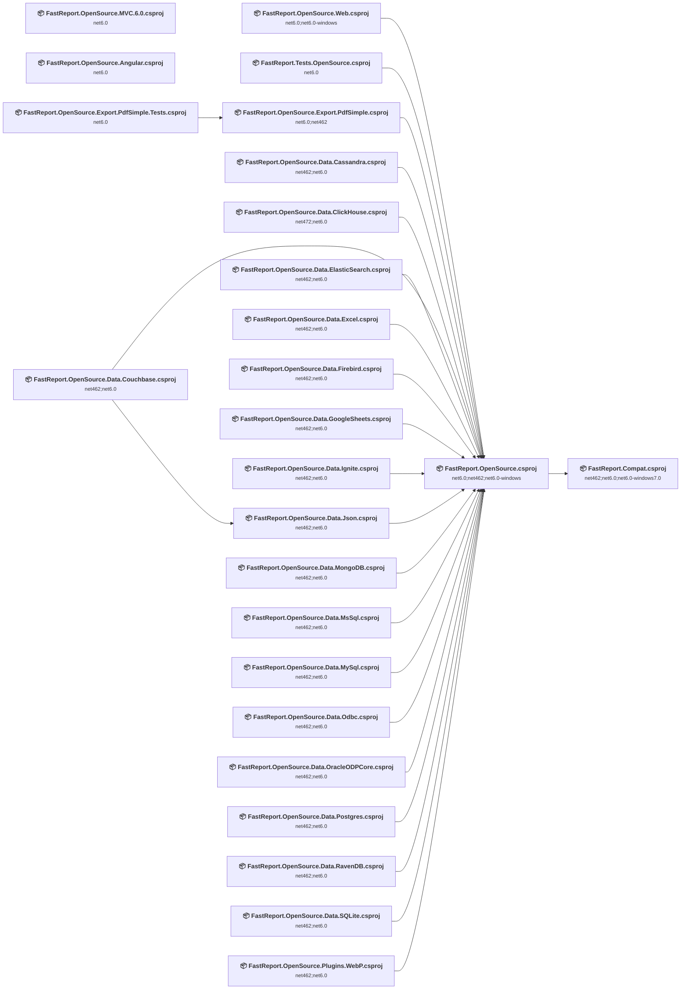
```mermaid
flowchart LR
    P1["<b>📦&nbsp;FastReport.Compat.csproj</b><br/><small>net462;net6.0;net6.0-windows7.0</small>"]
    P2["<b>📦&nbsp;FastReport.OpenSource.Web.csproj</b><br/><small>net6.0;net6.0-windows</small>"]
    P3["<b>📦&nbsp;FastReport.OpenSource.csproj</b><br/><small>net6.0;net462;net6.0-windows</small>"]
    P4["<b>📦&nbsp;FastReport.Tests.OpenSource.csproj</b><br/><small>net6.0</small>"]
    P5["<b>📦&nbsp;FastReport.OpenSource.MVC.6.0.csproj</b><br/><small>net6.0</small>"]
    P6["<b>📦&nbsp;FastReport.OpenSource.Angular.csproj</b><br/><small>net6.0</small>"]
    P7["<b>📦&nbsp;FastReport.OpenSource.Export.PdfSimple.Tests.csproj</b><br/><small>net6.0</small>"]
    P8["<b>📦&nbsp;FastReport.OpenSource.Export.PdfSimple.csproj</b><br/><small>net6.0;net462</small>"]
    P9["<b>📦&nbsp;FastReport.OpenSource.Data.Cassandra.csproj</b><br/><small>net462;net6.0</small>"]
    P10["<b>📦&nbsp;FastReport.OpenSource.Data.ClickHouse.csproj</b><br/><small>net472;net6.0</small>"]
    P11["<b>📦&nbsp;FastReport.OpenSource.Data.Couchbase.csproj</b><br/><small>net462;net6.0</small>"]
    P12["<b>📦&nbsp;FastReport.OpenSource.Data.ElasticSearch.csproj</b><br/><small>net462;net6.0</small>"]
    P13["<b>📦&nbsp;FastReport.OpenSource.Data.Excel.csproj</b><br/><small>net462;net6.0</small>"]
    P14["<b>📦&nbsp;FastReport.OpenSource.Data.Firebird.csproj</b><br/><small>net462;net6.0</small>"]
    P15["<b>📦&nbsp;FastReport.OpenSource.Data.GoogleSheets.csproj</b><br/><small>net462;net6.0</small>"]
    P16["<b>📦&nbsp;FastReport.OpenSource.Data.Ignite.csproj</b><br/><small>net462;net6.0</small>"]
    P17["<b>📦&nbsp;FastReport.OpenSource.Data.Json.csproj</b><br/><small>net462;net6.0</small>"]
    P18["<b>📦&nbsp;FastReport.OpenSource.Data.MongoDB.csproj</b><br/><small>net462;net6.0</small>"]
    P19["<b>📦&nbsp;FastReport.OpenSource.Data.MsSql.csproj</b><br/><small>net462;net6.0</small>"]
    P20["<b>📦&nbsp;FastReport.OpenSource.Data.MySql.csproj</b><br/><small>net462;net6.0</small>"]
    P21["<b>📦&nbsp;FastReport.OpenSource.Data.Odbc.csproj</b><br/><small>net462;net6.0</small>"]
    P22["<b>📦&nbsp;FastReport.OpenSource.Data.OracleODPCore.csproj</b><br/><small>net462;net6.0</small>"]
    P23["<b>📦&nbsp;FastReport.OpenSource.Data.Postgres.csproj</b><br/><small>net462;net6.0</small>"]
    P24["<b>📦&nbsp;FastReport.OpenSource.Data.RavenDB.csproj</b><br/><small>net462;net6.0</small>"]
    P25["<b>📦&nbsp;FastReport.OpenSource.Data.SQLite.csproj</b><br/><small>net462;net6.0</small>"]
    P26["<b>📦&nbsp;FastReport.OpenSource.Plugins.WebP.csproj</b><br/><small>net462;net6.0</small>"]
    P2 --> P3
    P3 --> P1
    P4 --> P3
    P7 --> P8
    P8 --> P3
    P9 --> P3
    P10 --> P3
    P11 --> P17
    P11 --> P3
    P12 --> P3
    P13 --> P3
    P14 --> P3
    P15 --> P3
    P16 --> P3
    P17 --> P3
    P18 --> P3
    P19 --> P3
    P20 --> P3
    P21 --> P3
    P22 --> P3
    P23 --> P3
    P24 --> P3
    P25 --> P3
    P26 --> P3
    click P1 "#fastreportcompatfastreportcompatfastreportcompatcsproj"
    click P2 "#fastreportcorewebfastreportopensourcewebcsproj"
    click P3 "#fastreportopensourcefastreportopensourcecsproj"
    click P4 "#toolsfastreporttestsopensourcefastreporttestsopensourcecsproj"
    click P5 "#demosopensourcemvcfastreportopensourcemvc60fastreportopensourcemvc60csproj"
    click P6 "#demosopensourcespafastreportopensourceangularfastreportopensourceangularcsproj"
    click P7 "#extrasopensourcefastreportopensourceexportpdfsimplefastreportopensourceexportpdfsimpletestsfastreportopensourceexportpdfsimpletestscsproj"
    click P8 "#extrasopensourcefastreportopensourceexportpdfsimplefastreportopensourceexportpdfsimplefastreportopensourceexportpdfsimplecsproj"
    click P9 "#extrascorefastreportdatafastreportdatacassandrafastreportopensourcedatacassandracsproj"
    click P10 "#extrascorefastreportdatafastreportdataclickhousefastreportopensourcedataclickhousecsproj"
    click P11 "#extrascorefastreportdatafastreportdatacouchbasefastreportopensourcedatacouchbasecsproj"
    click P12 "#extrascorefastreportdatafastreportdataelasticsearchfastreportopensourcedataelasticsearchcsproj"
    click P13 "#extrascorefastreportdatafastreportdataexcelfastreportopensourcedataexcelcsproj"
    click P14 "#extrascorefastreportdatafastreportdatafirebirdfastreportopensourcedatafirebirdcsproj"
    click P15 "#extrascorefastreportdatafastreportdatagooglesheetsfastreportopensourcedatagooglesheetscsproj"
    click P16 "#extrascorefastreportdatafastreportdataignitefastreportopensourcedataignitecsproj"
    click P17 "#extrascorefastreportdatafastreportdatajsonfastreportopensourcedatajsoncsproj"
    click P18 "#extrascorefastreportdatafastreportdatamongodbfastreportopensourcedatamongodbcsproj"
    click P19 "#extrascorefastreportdatafastreportdatamssqlfastreportopensourcedatamssqlcsproj"
    click P20 "#extrascorefastreportdatafastreportdatamysqlfastreportopensourcedatamysqlcsproj"
    click P21 "#extrascorefastreportdatafastreportdataodbcfastreportopensourcedataodbccsproj"
    click P22 "#extrascorefastreportdatafastreportdataoracleodpcorefastreportopensourcedataoracleodpcorecsproj"
    click P23 "#extrascorefastreportdatafastreportdatapostgresfastreportopensourcedatapostgrescsproj"
    click P24 "#extrascorefastreportdatafastreportdataravendbfastreportopensourcedataravendbcsproj"
    click P25 "#extrascorefastreportdatafastreportdatasqlitefastreportopensourcedatasqlitecsproj"
    click P26 "#extrascorefastreportpluginfastreportpluginswebpfastreportopensourcepluginswebpcsproj"

```

## Project Details

### Demos\OpenSource\MVC\FastReport.OpenSource.MVC.6.0\FastReport.OpenSource.MVC.6.0.csproj

#### Project Info

- **Current Target Framework:** net6.0
- **Proposed Target Framework:** net10.0
- **SDK-style**: True
- **Project Kind:** AspNetCore
- **Dependencies**: 0
- **Dependants**: 0
- **Number of Files**: 13
- **Number of Files with Incidents**: 2
- **Lines of Code**: 271
- **Estimated LOC to modify**: 1+ (at least 0.4% of the project)

#### Dependency Graph

Legend:
📦 SDK-style project
⚙️ Classic project

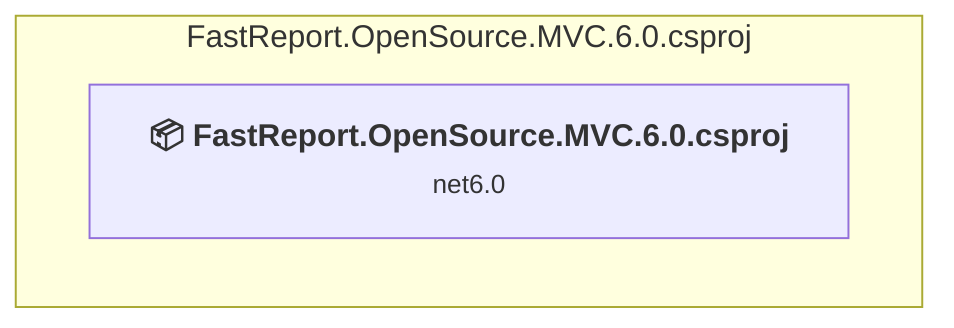
```mermaid
flowchart TB
    subgraph current["FastReport.OpenSource.MVC.6.0.csproj"]
        MAIN["<b>📦&nbsp;FastReport.OpenSource.MVC.6.0.csproj</b><br/><small>net6.0</small>"]
        click MAIN "#demosopensourcemvcfastreportopensourcemvc60fastreportopensourcemvc60csproj"
    end

```

### API Compatibility

| Category | Count | Impact |
| :--- | :---: | :--- |
| 🔴 Binary Incompatible | 0 | High - Require code changes |
| 🟡 Source Incompatible | 0 | Medium - Needs re-compilation and potential conflicting API error fixing |
| 🔵 Behavioral change | 1 | Low - Behavioral changes that may require testing at runtime |
| ✅ Compatible | 521 |  |
| ***Total APIs Analyzed*** | ***522*** |  |

### Demos\OpenSource\SPA\FastReport.OpenSource.Angular\FastReport.OpenSource.Angular.csproj

#### Project Info

- **Current Target Framework:** net6.0
- **Proposed Target Framework:** net10.0
- **SDK-style**: True
- **Project Kind:** AspNetCore
- **Dependencies**: 0
- **Dependants**: 0
- **Number of Files**: 10
- **Number of Files with Incidents**: 1
- **Lines of Code**: 168
- **Estimated LOC to modify**: 0+ (at least 0.0% of the project)

#### Dependency Graph

Legend:
📦 SDK-style project
⚙️ Classic project

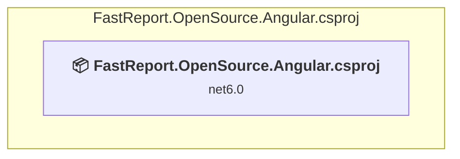
```mermaid
flowchart TB
    subgraph current["FastReport.OpenSource.Angular.csproj"]
        MAIN["<b>📦&nbsp;FastReport.OpenSource.Angular.csproj</b><br/><small>net6.0</small>"]
        click MAIN "#demosopensourcespafastreportopensourceangularfastreportopensourceangularcsproj"
    end

```

### API Compatibility

| Category | Count | Impact |
| :--- | :---: | :--- |
| 🔴 Binary Incompatible | 0 | High - Require code changes |
| 🟡 Source Incompatible | 0 | Medium - Needs re-compilation and potential conflicting API error fixing |
| 🔵 Behavioral change | 0 | Low - Behavioral changes that may require testing at runtime |
| ✅ Compatible | 259 |  |
| ***Total APIs Analyzed*** | ***259*** |  |

### Extras\Core\FastReport.Data\FastReport.Data.Cassandra\FastReport.OpenSource.Data.Cassandra.csproj

#### Project Info

- **Current Target Framework:** net462;net6.0
- **Proposed Target Framework:** net462;net6.0;net10.0
- **SDK-style**: True
- **Project Kind:** ClassLibrary
- **Dependencies**: 1
- **Dependants**: 0
- **Number of Files**: 2
- **Number of Files with Incidents**: 1
- **Lines of Code**: 153
- **Estimated LOC to modify**: 0+ (at least 0.0% of the project)

#### Dependency Graph

Legend:
📦 SDK-style project
⚙️ Classic project

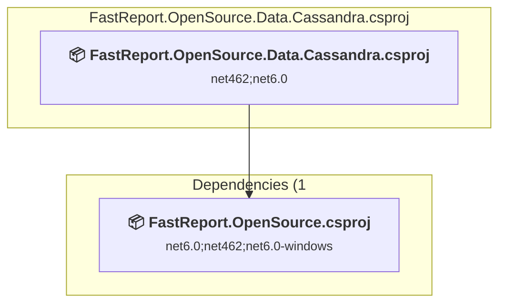
```mermaid
flowchart TB
    subgraph current["FastReport.OpenSource.Data.Cassandra.csproj"]
        MAIN["<b>📦&nbsp;FastReport.OpenSource.Data.Cassandra.csproj</b><br/><small>net462;net6.0</small>"]
        click MAIN "#extrascorefastreportdatafastreportdatacassandrafastreportopensourcedatacassandracsproj"
    end
    subgraph downstream["Dependencies (1"]
        P3["<b>📦&nbsp;FastReport.OpenSource.csproj</b><br/><small>net6.0;net462;net6.0-windows</small>"]
        click P3 "#fastreportopensourcefastreportopensourcecsproj"
    end
    MAIN --> P3

```

### API Compatibility

| Category | Count | Impact |
| :--- | :---: | :--- |
| 🔴 Binary Incompatible | 0 | High - Require code changes |
| 🟡 Source Incompatible | 0 | Medium - Needs re-compilation and potential conflicting API error fixing |
| 🔵 Behavioral change | 0 | Low - Behavioral changes that may require testing at runtime |
| ✅ Compatible | 211 |  |
| ***Total APIs Analyzed*** | ***211*** |  |

### Extras\Core\FastReport.Data\FastReport.Data.ClickHouse\FastReport.OpenSource.Data.ClickHouse.csproj

#### Project Info

- **Current Target Framework:** net472;net6.0
- **Proposed Target Framework:** net472;net6.0;net10.0
- **SDK-style**: True
- **Project Kind:** ClassLibrary
- **Dependencies**: 1
- **Dependants**: 0
- **Number of Files**: 2
- **Number of Files with Incidents**: 1
- **Lines of Code**: 331
- **Estimated LOC to modify**: 0+ (at least 0.0% of the project)

#### Dependency Graph

Legend:
📦 SDK-style project
⚙️ Classic project

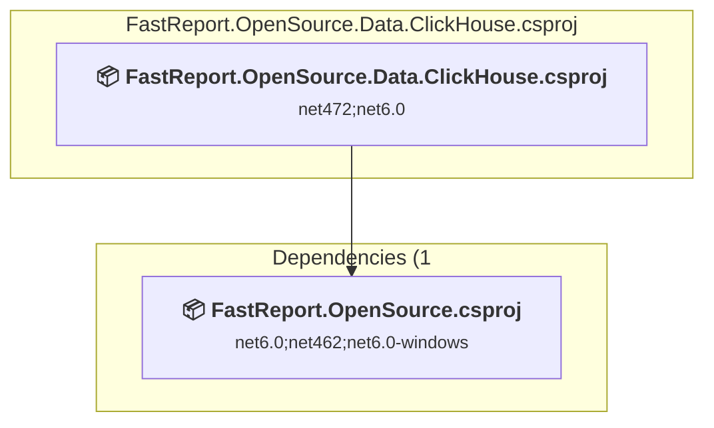
```mermaid
flowchart TB
    subgraph current["FastReport.OpenSource.Data.ClickHouse.csproj"]
        MAIN["<b>📦&nbsp;FastReport.OpenSource.Data.ClickHouse.csproj</b><br/><small>net472;net6.0</small>"]
        click MAIN "#extrascorefastreportdatafastreportdataclickhousefastreportopensourcedataclickhousecsproj"
    end
    subgraph downstream["Dependencies (1"]
        P3["<b>📦&nbsp;FastReport.OpenSource.csproj</b><br/><small>net6.0;net462;net6.0-windows</small>"]
        click P3 "#fastreportopensourcefastreportopensourcecsproj"
    end
    MAIN --> P3

```

### API Compatibility

| Category | Count | Impact |
| :--- | :---: | :--- |
| 🔴 Binary Incompatible | 0 | High - Require code changes |
| 🟡 Source Incompatible | 0 | Medium - Needs re-compilation and potential conflicting API error fixing |
| 🔵 Behavioral change | 0 | Low - Behavioral changes that may require testing at runtime |
| ✅ Compatible | 452 |  |
| ***Total APIs Analyzed*** | ***452*** |  |

### Extras\Core\FastReport.Data\FastReport.Data.Couchbase\FastReport.OpenSource.Data.Couchbase.csproj

#### Project Info

- **Current Target Framework:** net462;net6.0
- **Proposed Target Framework:** net462;net6.0;net10.0
- **SDK-style**: True
- **Project Kind:** ClassLibrary
- **Dependencies**: 2
- **Dependants**: 0
- **Number of Files**: 3
- **Number of Files with Incidents**: 2
- **Lines of Code**: 331
- **Estimated LOC to modify**: 4+ (at least 1.2% of the project)

#### Dependency Graph

Legend:
📦 SDK-style project
⚙️ Classic project

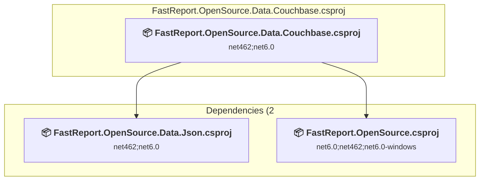
```mermaid
flowchart TB
    subgraph current["FastReport.OpenSource.Data.Couchbase.csproj"]
        MAIN["<b>📦&nbsp;FastReport.OpenSource.Data.Couchbase.csproj</b><br/><small>net462;net6.0</small>"]
        click MAIN "#extrascorefastreportdatafastreportdatacouchbasefastreportopensourcedatacouchbasecsproj"
    end
    subgraph downstream["Dependencies (2"]
        P17["<b>📦&nbsp;FastReport.OpenSource.Data.Json.csproj</b><br/><small>net462;net6.0</small>"]
        P3["<b>📦&nbsp;FastReport.OpenSource.csproj</b><br/><small>net6.0;net462;net6.0-windows</small>"]
        click P17 "#extrascorefastreportdatafastreportdatajsonfastreportopensourcedatajsoncsproj"
        click P3 "#fastreportopensourcefastreportopensourcecsproj"
    end
    MAIN --> P17
    MAIN --> P3

```

### API Compatibility

| Category | Count | Impact |
| :--- | :---: | :--- |
| 🔴 Binary Incompatible | 0 | High - Require code changes |
| 🟡 Source Incompatible | 0 | Medium - Needs re-compilation and potential conflicting API error fixing |
| 🔵 Behavioral change | 4 | Low - Behavioral changes that may require testing at runtime |
| ✅ Compatible | 473 |  |
| ***Total APIs Analyzed*** | ***477*** |  |

### Extras\Core\FastReport.Data\FastReport.Data.ElasticSearch\FastReport.OpenSource.Data.ElasticSearch.csproj

#### Project Info

- **Current Target Framework:** net462;net6.0
- **Proposed Target Framework:** net462;net6.0;net10.0
- **SDK-style**: True
- **Project Kind:** ClassLibrary
- **Dependencies**: 1
- **Dependants**: 0
- **Number of Files**: 3
- **Number of Files with Incidents**: 2
- **Lines of Code**: 504
- **Estimated LOC to modify**: 8+ (at least 1.6% of the project)

#### Dependency Graph

Legend:
📦 SDK-style project
⚙️ Classic project

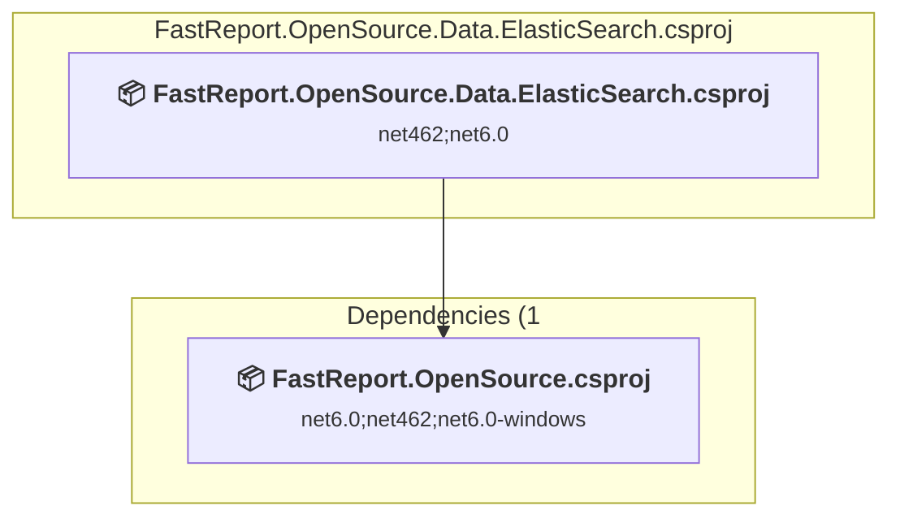
```mermaid
flowchart TB
    subgraph current["FastReport.OpenSource.Data.ElasticSearch.csproj"]
        MAIN["<b>📦&nbsp;FastReport.OpenSource.Data.ElasticSearch.csproj</b><br/><small>net462;net6.0</small>"]
        click MAIN "#extrascorefastreportdatafastreportdataelasticsearchfastreportopensourcedataelasticsearchcsproj"
    end
    subgraph downstream["Dependencies (1"]
        P3["<b>📦&nbsp;FastReport.OpenSource.csproj</b><br/><small>net6.0;net462;net6.0-windows</small>"]
        click P3 "#fastreportopensourcefastreportopensourcecsproj"
    end
    MAIN --> P3

```

### API Compatibility

| Category | Count | Impact |
| :--- | :---: | :--- |
| 🔴 Binary Incompatible | 0 | High - Require code changes |
| 🟡 Source Incompatible | 8 | Medium - Needs re-compilation and potential conflicting API error fixing |
| 🔵 Behavioral change | 0 | Low - Behavioral changes that may require testing at runtime |
| ✅ Compatible | 786 |  |
| ***Total APIs Analyzed*** | ***794*** |  |

### Extras\Core\FastReport.Data\FastReport.Data.Excel\FastReport.OpenSource.Data.Excel.csproj

#### Project Info

- **Current Target Framework:** net462;net6.0
- **Proposed Target Framework:** net462;net6.0;net10.0
- **SDK-style**: True
- **Project Kind:** ClassLibrary
- **Dependencies**: 1
- **Dependants**: 0
- **Number of Files**: 3
- **Number of Files with Incidents**: 1
- **Lines of Code**: 406
- **Estimated LOC to modify**: 0+ (at least 0.0% of the project)

#### Dependency Graph

Legend:
📦 SDK-style project
⚙️ Classic project

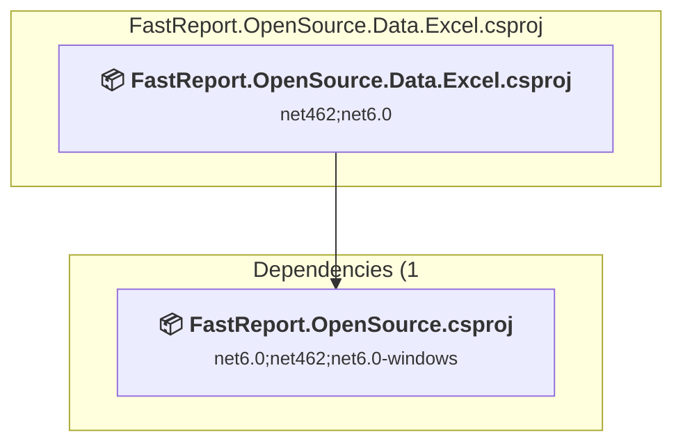
```mermaid
flowchart TB
    subgraph current["FastReport.OpenSource.Data.Excel.csproj"]
        MAIN["<b>📦&nbsp;FastReport.OpenSource.Data.Excel.csproj</b><br/><small>net462;net6.0</small>"]
        click MAIN "#extrascorefastreportdatafastreportdataexcelfastreportopensourcedataexcelcsproj"
    end
    subgraph downstream["Dependencies (1"]
        P3["<b>📦&nbsp;FastReport.OpenSource.csproj</b><br/><small>net6.0;net462;net6.0-windows</small>"]
        click P3 "#fastreportopensourcefastreportopensourcecsproj"
    end
    MAIN --> P3

```

### API Compatibility

| Category | Count | Impact |
| :--- | :---: | :--- |
| 🔴 Binary Incompatible | 0 | High - Require code changes |
| 🟡 Source Incompatible | 0 | Medium - Needs re-compilation and potential conflicting API error fixing |
| 🔵 Behavioral change | 0 | Low - Behavioral changes that may require testing at runtime |
| ✅ Compatible | 485 |  |
| ***Total APIs Analyzed*** | ***485*** |  |

### Extras\Core\FastReport.Data\FastReport.Data.Firebird\FastReport.OpenSource.Data.Firebird.csproj

#### Project Info

- **Current Target Framework:** net462;net6.0
- **Proposed Target Framework:** net462;net6.0;net10.0
- **SDK-style**: True
- **Project Kind:** ClassLibrary
- **Dependencies**: 1
- **Dependants**: 0
- **Number of Files**: 2
- **Number of Files with Incidents**: 1
- **Lines of Code**: 64
- **Estimated LOC to modify**: 0+ (at least 0.0% of the project)

#### Dependency Graph

Legend:
📦 SDK-style project
⚙️ Classic project

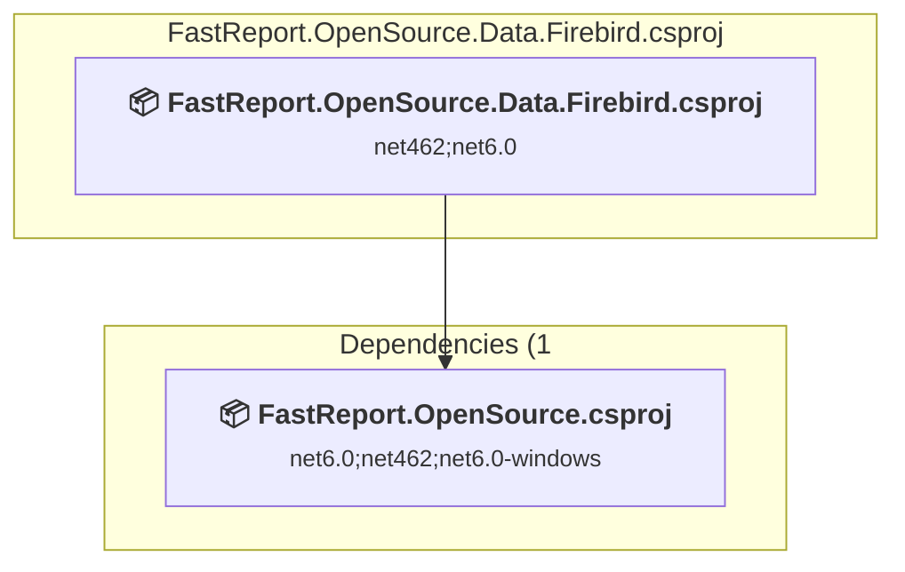
```mermaid
flowchart TB
    subgraph current["FastReport.OpenSource.Data.Firebird.csproj"]
        MAIN["<b>📦&nbsp;FastReport.OpenSource.Data.Firebird.csproj</b><br/><small>net462;net6.0</small>"]
        click MAIN "#extrascorefastreportdatafastreportdatafirebirdfastreportopensourcedatafirebirdcsproj"
    end
    subgraph downstream["Dependencies (1"]
        P3["<b>📦&nbsp;FastReport.OpenSource.csproj</b><br/><small>net6.0;net462;net6.0-windows</small>"]
        click P3 "#fastreportopensourcefastreportopensourcecsproj"
    end
    MAIN --> P3

```

### API Compatibility

| Category | Count | Impact |
| :--- | :---: | :--- |
| 🔴 Binary Incompatible | 0 | High - Require code changes |
| 🟡 Source Incompatible | 0 | Medium - Needs re-compilation and potential conflicting API error fixing |
| 🔵 Behavioral change | 0 | Low - Behavioral changes that may require testing at runtime |
| ✅ Compatible | 64 |  |
| ***Total APIs Analyzed*** | ***64*** |  |

### Extras\Core\FastReport.Data\FastReport.Data.GoogleSheets\FastReport.OpenSource.Data.GoogleSheets.csproj

#### Project Info

- **Current Target Framework:** net462;net6.0
- **Proposed Target Framework:** net462;net6.0;net10.0
- **SDK-style**: True
- **Project Kind:** ClassLibrary
- **Dependencies**: 1
- **Dependants**: 0
- **Number of Files**: 18
- **Number of Files with Incidents**: 3
- **Lines of Code**: 1880
- **Estimated LOC to modify**: 13+ (at least 0.7% of the project)

#### Dependency Graph

Legend:
📦 SDK-style project
⚙️ Classic project

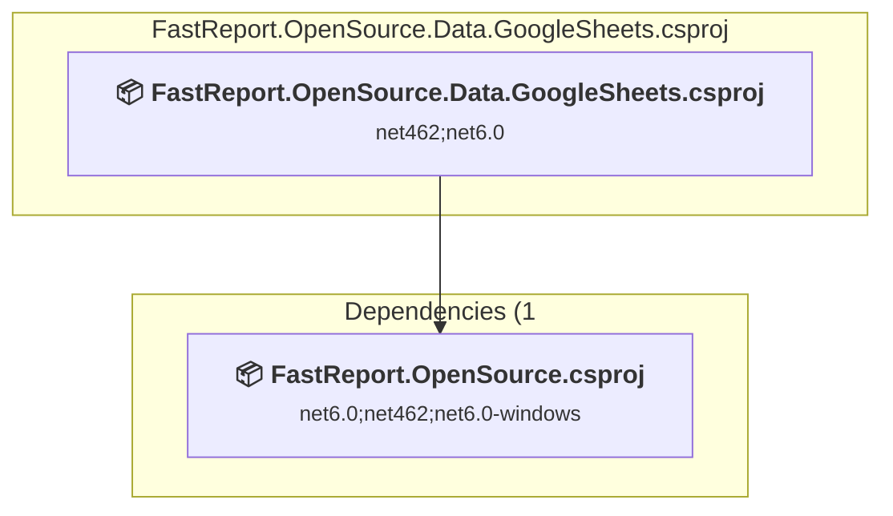
```mermaid
flowchart TB
    subgraph current["FastReport.OpenSource.Data.GoogleSheets.csproj"]
        MAIN["<b>📦&nbsp;FastReport.OpenSource.Data.GoogleSheets.csproj</b><br/><small>net462;net6.0</small>"]
        click MAIN "#extrascorefastreportdatafastreportdatagooglesheetsfastreportopensourcedatagooglesheetscsproj"
    end
    subgraph downstream["Dependencies (1"]
        P3["<b>📦&nbsp;FastReport.OpenSource.csproj</b><br/><small>net6.0;net462;net6.0-windows</small>"]
        click P3 "#fastreportopensourcefastreportopensourcecsproj"
    end
    MAIN --> P3

```

### API Compatibility

| Category | Count | Impact |
| :--- | :---: | :--- |
| 🔴 Binary Incompatible | 0 | High - Require code changes |
| 🟡 Source Incompatible | 6 | Medium - Needs re-compilation and potential conflicting API error fixing |
| 🔵 Behavioral change | 7 | Low - Behavioral changes that may require testing at runtime |
| ✅ Compatible | 1679 |  |
| ***Total APIs Analyzed*** | ***1692*** |  |

### Extras\Core\FastReport.Data\FastReport.Data.Ignite\FastReport.OpenSource.Data.Ignite.csproj

#### Project Info

- **Current Target Framework:** net462;net6.0
- **Proposed Target Framework:** net462;net6.0;net10.0
- **SDK-style**: True
- **Project Kind:** ClassLibrary
- **Dependencies**: 1
- **Dependants**: 0
- **Number of Files**: 2
- **Number of Files with Incidents**: 1
- **Lines of Code**: 521
- **Estimated LOC to modify**: 0+ (at least 0.0% of the project)

#### Dependency Graph

Legend:
📦 SDK-style project
⚙️ Classic project

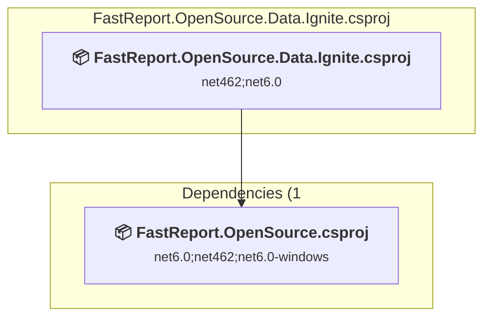
```mermaid
flowchart TB
    subgraph current["FastReport.OpenSource.Data.Ignite.csproj"]
        MAIN["<b>📦&nbsp;FastReport.OpenSource.Data.Ignite.csproj</b><br/><small>net462;net6.0</small>"]
        click MAIN "#extrascorefastreportdatafastreportdataignitefastreportopensourcedataignitecsproj"
    end
    subgraph downstream["Dependencies (1"]
        P3["<b>📦&nbsp;FastReport.OpenSource.csproj</b><br/><small>net6.0;net462;net6.0-windows</small>"]
        click P3 "#fastreportopensourcefastreportopensourcecsproj"
    end
    MAIN --> P3

```

### API Compatibility

| Category | Count | Impact |
| :--- | :---: | :--- |
| 🔴 Binary Incompatible | 0 | High - Require code changes |
| 🟡 Source Incompatible | 0 | Medium - Needs re-compilation and potential conflicting API error fixing |
| 🔵 Behavioral change | 0 | Low - Behavioral changes that may require testing at runtime |
| ✅ Compatible | 493 |  |
| ***Total APIs Analyzed*** | ***493*** |  |

### Extras\Core\FastReport.Data\FastReport.Data.Json\FastReport.OpenSource.Data.Json.csproj

#### Project Info

- **Current Target Framework:** net462;net6.0
- **Proposed Target Framework:** net462;net6.0;net10.0
- **SDK-style**: True
- **Project Kind:** ClassLibrary
- **Dependencies**: 1
- **Dependants**: 1
- **Number of Files**: 13
- **Number of Files with Incidents**: 2
- **Lines of Code**: 1779
- **Estimated LOC to modify**: 4+ (at least 0.2% of the project)

#### Dependency Graph

Legend:
📦 SDK-style project
⚙️ Classic project

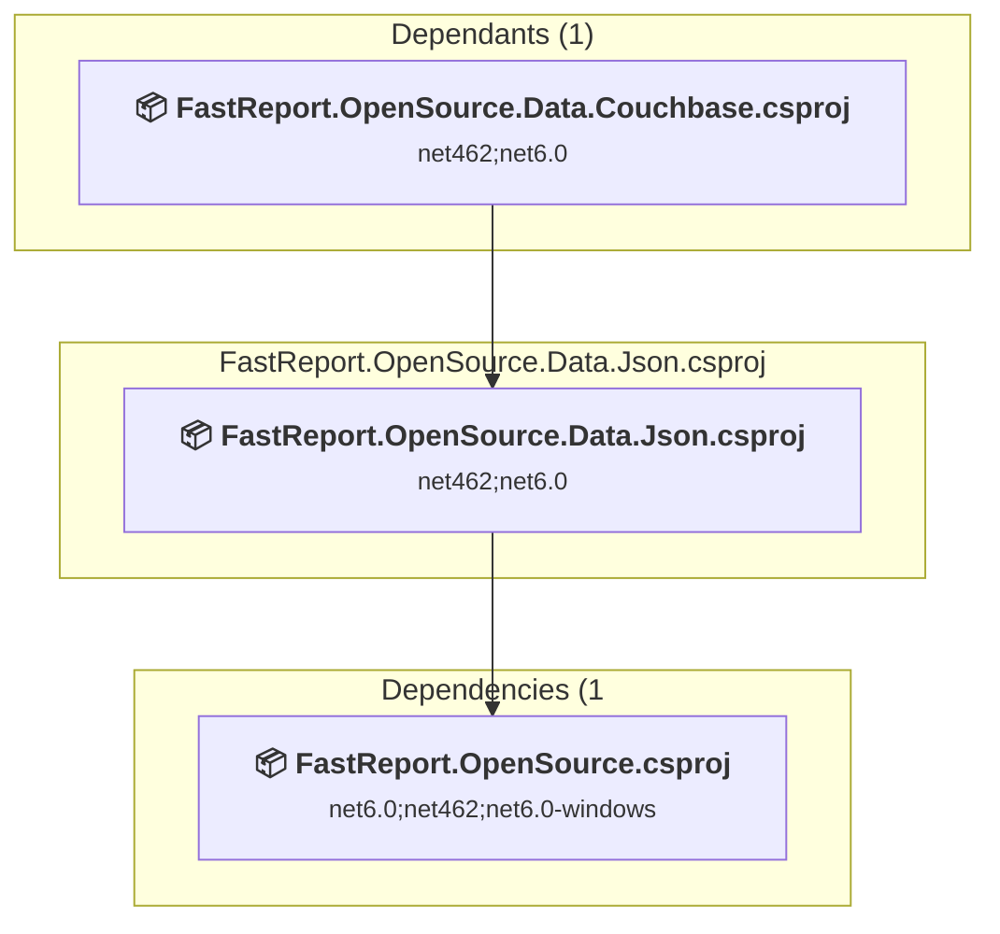
```mermaid
flowchart TB
    subgraph upstream["Dependants (1)"]
        P11["<b>📦&nbsp;FastReport.OpenSource.Data.Couchbase.csproj</b><br/><small>net462;net6.0</small>"]
        click P11 "#extrascorefastreportdatafastreportdatacouchbasefastreportopensourcedatacouchbasecsproj"
    end
    subgraph current["FastReport.OpenSource.Data.Json.csproj"]
        MAIN["<b>📦&nbsp;FastReport.OpenSource.Data.Json.csproj</b><br/><small>net462;net6.0</small>"]
        click MAIN "#extrascorefastreportdatafastreportdatajsonfastreportopensourcedatajsoncsproj"
    end
    subgraph downstream["Dependencies (1"]
        P3["<b>📦&nbsp;FastReport.OpenSource.csproj</b><br/><small>net6.0;net462;net6.0-windows</small>"]
        click P3 "#fastreportopensourcefastreportopensourcecsproj"
    end
    P11 --> MAIN
    MAIN --> P3

```

### API Compatibility

| Category | Count | Impact |
| :--- | :---: | :--- |
| 🔴 Binary Incompatible | 0 | High - Require code changes |
| 🟡 Source Incompatible | 4 | Medium - Needs re-compilation and potential conflicting API error fixing |
| 🔵 Behavioral change | 0 | Low - Behavioral changes that may require testing at runtime |
| ✅ Compatible | 2723 |  |
| ***Total APIs Analyzed*** | ***2727*** |  |

### Extras\Core\FastReport.Data\FastReport.Data.MongoDB\FastReport.OpenSource.Data.MongoDB.csproj

#### Project Info

- **Current Target Framework:** net462;net6.0
- **Proposed Target Framework:** net462;net6.0;net10.0
- **SDK-style**: True
- **Project Kind:** ClassLibrary
- **Dependencies**: 1
- **Dependants**: 0
- **Number of Files**: 2
- **Number of Files with Incidents**: 1
- **Lines of Code**: 237
- **Estimated LOC to modify**: 0+ (at least 0.0% of the project)

#### Dependency Graph

Legend:
📦 SDK-style project
⚙️ Classic project

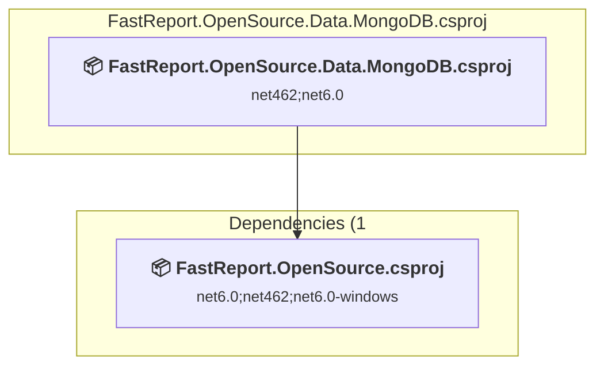
```mermaid
flowchart TB
    subgraph current["FastReport.OpenSource.Data.MongoDB.csproj"]
        MAIN["<b>📦&nbsp;FastReport.OpenSource.Data.MongoDB.csproj</b><br/><small>net462;net6.0</small>"]
        click MAIN "#extrascorefastreportdatafastreportdatamongodbfastreportopensourcedatamongodbcsproj"
    end
    subgraph downstream["Dependencies (1"]
        P3["<b>📦&nbsp;FastReport.OpenSource.csproj</b><br/><small>net6.0;net462;net6.0-windows</small>"]
        click P3 "#fastreportopensourcefastreportopensourcecsproj"
    end
    MAIN --> P3

```

### API Compatibility

| Category | Count | Impact |
| :--- | :---: | :--- |
| 🔴 Binary Incompatible | 0 | High - Require code changes |
| 🟡 Source Incompatible | 0 | Medium - Needs re-compilation and potential conflicting API error fixing |
| 🔵 Behavioral change | 0 | Low - Behavioral changes that may require testing at runtime |
| ✅ Compatible | 320 |  |
| ***Total APIs Analyzed*** | ***320*** |  |

### Extras\Core\FastReport.Data\FastReport.Data.MsSql\FastReport.OpenSource.Data.MsSql.csproj

#### Project Info

- **Current Target Framework:** net462;net6.0
- **Proposed Target Framework:** net462;net6.0;net10.0
- **SDK-style**: True
- **Project Kind:** ClassLibrary
- **Dependencies**: 1
- **Dependants**: 0
- **Number of Files**: 2
- **Number of Files with Incidents**: 2
- **Lines of Code**: 323
- **Estimated LOC to modify**: 15+ (at least 4.6% of the project)

#### Dependency Graph

Legend:
📦 SDK-style project
⚙️ Classic project

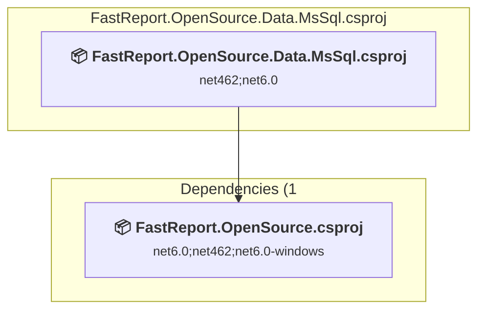
```mermaid
flowchart TB
    subgraph current["FastReport.OpenSource.Data.MsSql.csproj"]
        MAIN["<b>📦&nbsp;FastReport.OpenSource.Data.MsSql.csproj</b><br/><small>net462;net6.0</small>"]
        click MAIN "#extrascorefastreportdatafastreportdatamssqlfastreportopensourcedatamssqlcsproj"
    end
    subgraph downstream["Dependencies (1"]
        P3["<b>📦&nbsp;FastReport.OpenSource.csproj</b><br/><small>net6.0;net462;net6.0-windows</small>"]
        click P3 "#fastreportopensourcefastreportopensourcecsproj"
    end
    MAIN --> P3

```

### API Compatibility

| Category | Count | Impact |
| :--- | :---: | :--- |
| 🔴 Binary Incompatible | 0 | High - Require code changes |
| 🟡 Source Incompatible | 15 | Medium - Needs re-compilation and potential conflicting API error fixing |
| 🔵 Behavioral change | 0 | Low - Behavioral changes that may require testing at runtime |
| ✅ Compatible | 382 |  |
| ***Total APIs Analyzed*** | ***397*** |  |

### Extras\Core\FastReport.Data\FastReport.Data.MySql\FastReport.OpenSource.Data.MySql.csproj

#### Project Info

- **Current Target Framework:** net462;net6.0
- **Proposed Target Framework:** net462;net6.0;net10.0
- **SDK-style**: True
- **Project Kind:** ClassLibrary
- **Dependencies**: 1
- **Dependants**: 0
- **Number of Files**: 2
- **Number of Files with Incidents**: 1
- **Lines of Code**: 454
- **Estimated LOC to modify**: 0+ (at least 0.0% of the project)

#### Dependency Graph

Legend:
📦 SDK-style project
⚙️ Classic project

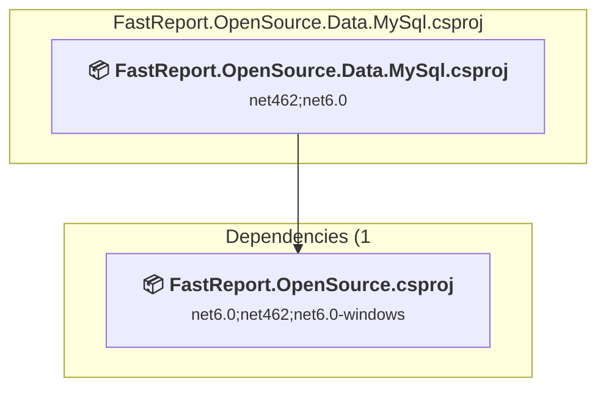
```mermaid
flowchart TB
    subgraph current["FastReport.OpenSource.Data.MySql.csproj"]
        MAIN["<b>📦&nbsp;FastReport.OpenSource.Data.MySql.csproj</b><br/><small>net462;net6.0</small>"]
        click MAIN "#extrascorefastreportdatafastreportdatamysqlfastreportopensourcedatamysqlcsproj"
    end
    subgraph downstream["Dependencies (1"]
        P3["<b>📦&nbsp;FastReport.OpenSource.csproj</b><br/><small>net6.0;net462;net6.0-windows</small>"]
        click P3 "#fastreportopensourcefastreportopensourcecsproj"
    end
    MAIN --> P3

```

### API Compatibility

| Category | Count | Impact |
| :--- | :---: | :--- |
| 🔴 Binary Incompatible | 0 | High - Require code changes |
| 🟡 Source Incompatible | 0 | Medium - Needs re-compilation and potential conflicting API error fixing |
| 🔵 Behavioral change | 0 | Low - Behavioral changes that may require testing at runtime |
| ✅ Compatible | 584 |  |
| ***Total APIs Analyzed*** | ***584*** |  |

### Extras\Core\FastReport.Data\FastReport.Data.Odbc\FastReport.OpenSource.Data.Odbc.csproj

#### Project Info

- **Current Target Framework:** net462;net6.0
- **Proposed Target Framework:** net462;net6.0;net10.0
- **SDK-style**: True
- **Project Kind:** ClassLibrary
- **Dependencies**: 1
- **Dependants**: 0
- **Number of Files**: 2
- **Number of Files with Incidents**: 2
- **Lines of Code**: 91
- **Estimated LOC to modify**: 16+ (at least 17.6% of the project)

#### Dependency Graph

Legend:
📦 SDK-style project
⚙️ Classic project

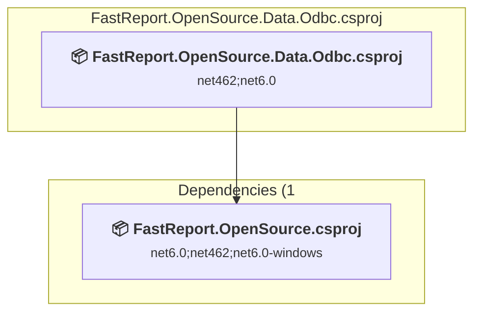
```mermaid
flowchart TB
    subgraph current["FastReport.OpenSource.Data.Odbc.csproj"]
        MAIN["<b>📦&nbsp;FastReport.OpenSource.Data.Odbc.csproj</b><br/><small>net462;net6.0</small>"]
        click MAIN "#extrascorefastreportdatafastreportdataodbcfastreportopensourcedataodbccsproj"
    end
    subgraph downstream["Dependencies (1"]
        P3["<b>📦&nbsp;FastReport.OpenSource.csproj</b><br/><small>net6.0;net462;net6.0-windows</small>"]
        click P3 "#fastreportopensourcefastreportopensourcecsproj"
    end
    MAIN --> P3

```

### API Compatibility

| Category | Count | Impact |
| :--- | :---: | :--- |
| 🔴 Binary Incompatible | 0 | High - Require code changes |
| 🟡 Source Incompatible | 16 | Medium - Needs re-compilation and potential conflicting API error fixing |
| 🔵 Behavioral change | 0 | Low - Behavioral changes that may require testing at runtime |
| ✅ Compatible | 64 |  |
| ***Total APIs Analyzed*** | ***80*** |  |

### Extras\Core\FastReport.Data\FastReport.Data.OracleODPCore\FastReport.OpenSource.Data.OracleODPCore.csproj

#### Project Info

- **Current Target Framework:** net462;net6.0
- **Proposed Target Framework:** net462;net6.0;net10.0
- **SDK-style**: True
- **Project Kind:** ClassLibrary
- **Dependencies**: 1
- **Dependants**: 0
- **Number of Files**: 2
- **Number of Files with Incidents**: 1
- **Lines of Code**: 395
- **Estimated LOC to modify**: 0+ (at least 0.0% of the project)

#### Dependency Graph

Legend:
📦 SDK-style project
⚙️ Classic project

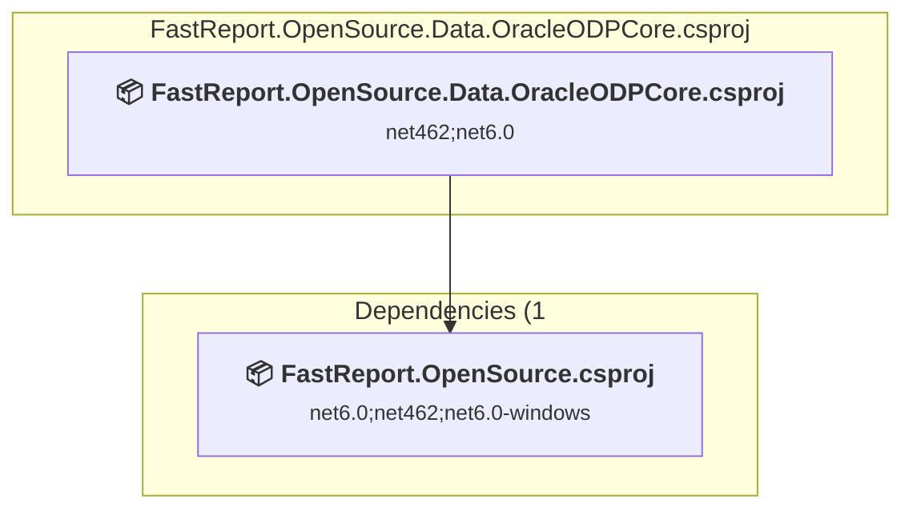
```mermaid
flowchart TB
    subgraph current["FastReport.OpenSource.Data.OracleODPCore.csproj"]
        MAIN["<b>📦&nbsp;FastReport.OpenSource.Data.OracleODPCore.csproj</b><br/><small>net462;net6.0</small>"]
        click MAIN "#extrascorefastreportdatafastreportdataoracleodpcorefastreportopensourcedataoracleodpcorecsproj"
    end
    subgraph downstream["Dependencies (1"]
        P3["<b>📦&nbsp;FastReport.OpenSource.csproj</b><br/><small>net6.0;net462;net6.0-windows</small>"]
        click P3 "#fastreportopensourcefastreportopensourcecsproj"
    end
    MAIN --> P3

```

### API Compatibility

| Category | Count | Impact |
| :--- | :---: | :--- |
| 🔴 Binary Incompatible | 0 | High - Require code changes |
| 🟡 Source Incompatible | 0 | Medium - Needs re-compilation and potential conflicting API error fixing |
| 🔵 Behavioral change | 0 | Low - Behavioral changes that may require testing at runtime |
| ✅ Compatible | 462 |  |
| ***Total APIs Analyzed*** | ***462*** |  |

### Extras\Core\FastReport.Data\FastReport.Data.Postgres\FastReport.OpenSource.Data.Postgres.csproj

#### Project Info

- **Current Target Framework:** net462;net6.0
- **Proposed Target Framework:** net462;net6.0;net10.0
- **SDK-style**: True
- **Project Kind:** ClassLibrary
- **Dependencies**: 1
- **Dependants**: 0
- **Number of Files**: 3
- **Number of Files with Incidents**: 1
- **Lines of Code**: 953
- **Estimated LOC to modify**: 0+ (at least 0.0% of the project)

#### Dependency Graph

Legend:
📦 SDK-style project
⚙️ Classic project

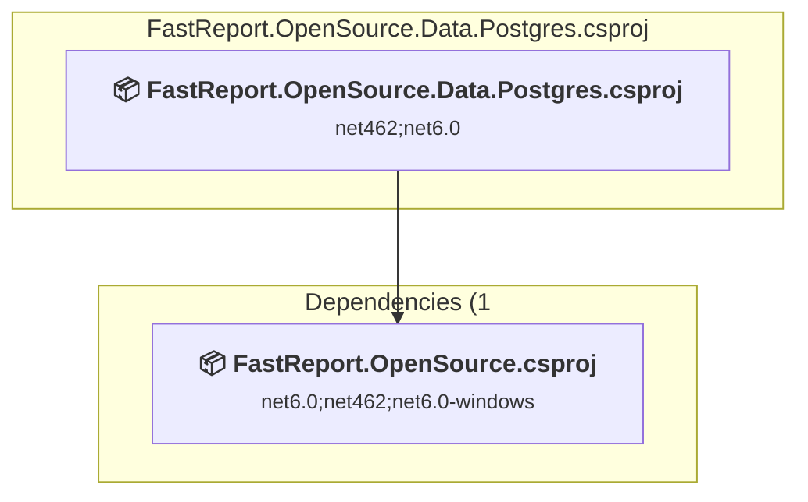
```mermaid
flowchart TB
    subgraph current["FastReport.OpenSource.Data.Postgres.csproj"]
        MAIN["<b>📦&nbsp;FastReport.OpenSource.Data.Postgres.csproj</b><br/><small>net462;net6.0</small>"]
        click MAIN "#extrascorefastreportdatafastreportdatapostgresfastreportopensourcedatapostgrescsproj"
    end
    subgraph downstream["Dependencies (1"]
        P3["<b>📦&nbsp;FastReport.OpenSource.csproj</b><br/><small>net6.0;net462;net6.0-windows</small>"]
        click P3 "#fastreportopensourcefastreportopensourcecsproj"
    end
    MAIN --> P3

```

### API Compatibility

| Category | Count | Impact |
| :--- | :---: | :--- |
| 🔴 Binary Incompatible | 0 | High - Require code changes |
| 🟡 Source Incompatible | 0 | Medium - Needs re-compilation and potential conflicting API error fixing |
| 🔵 Behavioral change | 0 | Low - Behavioral changes that may require testing at runtime |
| ✅ Compatible | 1413 |  |
| ***Total APIs Analyzed*** | ***1413*** |  |

### Extras\Core\FastReport.Data\FastReport.Data.RavenDB\FastReport.OpenSource.Data.RavenDB.csproj

#### Project Info

- **Current Target Framework:** net462;net6.0
- **Proposed Target Framework:** net462;net6.0;net10.0
- **SDK-style**: True
- **Project Kind:** ClassLibrary
- **Dependencies**: 1
- **Dependants**: 0
- **Number of Files**: 3
- **Number of Files with Incidents**: 2
- **Lines of Code**: 522
- **Estimated LOC to modify**: 2+ (at least 0.4% of the project)

#### Dependency Graph

Legend:
📦 SDK-style project
⚙️ Classic project

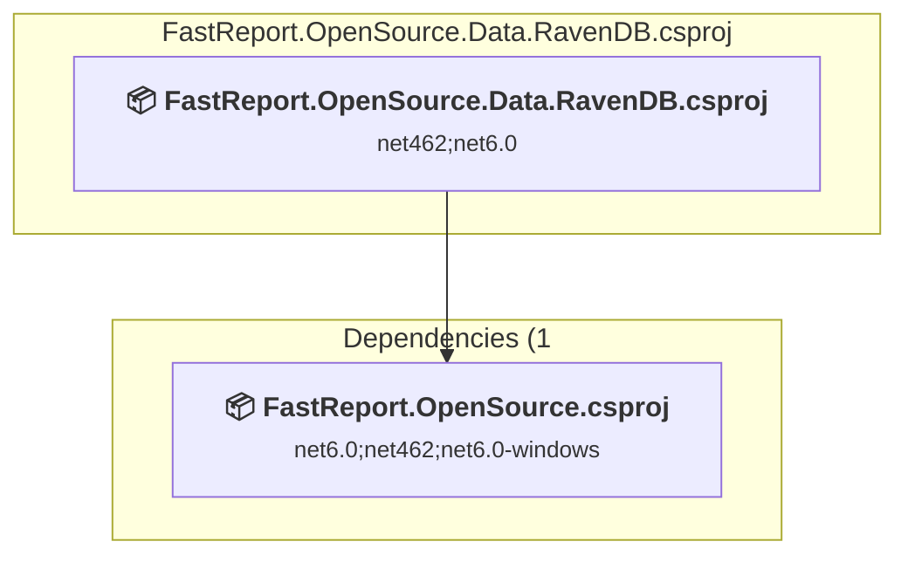
```mermaid
flowchart TB
    subgraph current["FastReport.OpenSource.Data.RavenDB.csproj"]
        MAIN["<b>📦&nbsp;FastReport.OpenSource.Data.RavenDB.csproj</b><br/><small>net462;net6.0</small>"]
        click MAIN "#extrascorefastreportdatafastreportdataravendbfastreportopensourcedataravendbcsproj"
    end
    subgraph downstream["Dependencies (1"]
        P3["<b>📦&nbsp;FastReport.OpenSource.csproj</b><br/><small>net6.0;net462;net6.0-windows</small>"]
        click P3 "#fastreportopensourcefastreportopensourcecsproj"
    end
    MAIN --> P3

```

### API Compatibility

| Category | Count | Impact |
| :--- | :---: | :--- |
| 🔴 Binary Incompatible | 0 | High - Require code changes |
| 🟡 Source Incompatible | 2 | Medium - Needs re-compilation and potential conflicting API error fixing |
| 🔵 Behavioral change | 0 | Low - Behavioral changes that may require testing at runtime |
| ✅ Compatible | 640 |  |
| ***Total APIs Analyzed*** | ***642*** |  |

### Extras\Core\FastReport.Data\FastReport.Data.SQLite\FastReport.OpenSource.Data.SQLite.csproj

#### Project Info

- **Current Target Framework:** net462;net6.0
- **Proposed Target Framework:** net462;net6.0;net10.0
- **SDK-style**: True
- **Project Kind:** ClassLibrary
- **Dependencies**: 1
- **Dependants**: 0
- **Number of Files**: 2
- **Number of Files with Incidents**: 1
- **Lines of Code**: 200
- **Estimated LOC to modify**: 0+ (at least 0.0% of the project)

#### Dependency Graph

Legend:
📦 SDK-style project
⚙️ Classic project

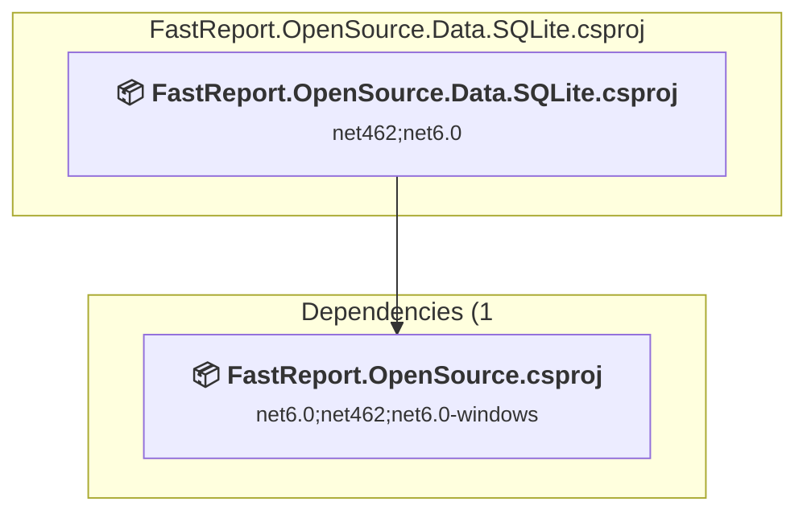
```mermaid
flowchart TB
    subgraph current["FastReport.OpenSource.Data.SQLite.csproj"]
        MAIN["<b>📦&nbsp;FastReport.OpenSource.Data.SQLite.csproj</b><br/><small>net462;net6.0</small>"]
        click MAIN "#extrascorefastreportdatafastreportdatasqlitefastreportopensourcedatasqlitecsproj"
    end
    subgraph downstream["Dependencies (1"]
        P3["<b>📦&nbsp;FastReport.OpenSource.csproj</b><br/><small>net6.0;net462;net6.0-windows</small>"]
        click P3 "#fastreportopensourcefastreportopensourcecsproj"
    end
    MAIN --> P3

```

### API Compatibility

| Category | Count | Impact |
| :--- | :---: | :--- |
| 🔴 Binary Incompatible | 0 | High - Require code changes |
| 🟡 Source Incompatible | 0 | Medium - Needs re-compilation and potential conflicting API error fixing |
| 🔵 Behavioral change | 0 | Low - Behavioral changes that may require testing at runtime |
| ✅ Compatible | 111 |  |
| ***Total APIs Analyzed*** | ***111*** |  |

### Extras\Core\FastReport.Plugin\FastReport.Plugins.WebP\FastReport.OpenSource.Plugins.WebP.csproj

#### Project Info

- **Current Target Framework:** net462;net6.0
- **Proposed Target Framework:** net462;net6.0;net10.0
- **SDK-style**: True
- **Project Kind:** ClassLibrary
- **Dependencies**: 1
- **Dependants**: 0
- **Number of Files**: 9
- **Number of Files with Incidents**: 2
- **Lines of Code**: 88
- **Estimated LOC to modify**: 5+ (at least 5.7% of the project)

#### Dependency Graph

Legend:
📦 SDK-style project
⚙️ Classic project

```mermaid
flowchart TB
    subgraph current["FastReport.OpenSource.Plugins.WebP.csproj"]
        MAIN["<b>📦&nbsp;FastReport.OpenSource.Plugins.WebP.csproj</b><br/><small>net462;net6.0</small>"]
        click MAIN "#extrascorefastreportpluginfastreportpluginswebpfastreportopensourcepluginswebpcsproj"
    end
    subgraph downstream["Dependencies (1"]
        P3["<b>📦&nbsp;FastReport.OpenSource.csproj</b><br/><small>net6.0;net462;net6.0-windows</small>"]
        click P3 "#fastreportopensourcefastreportopensourcecsproj"
    end
    MAIN --> P3

```

### API Compatibility

| Category | Count | Impact |
| :--- | :---: | :--- |
| 🔴 Binary Incompatible | 0 | High - Require code changes |
| 🟡 Source Incompatible | 5 | Medium - Needs re-compilation and potential conflicting API error fixing |
| 🔵 Behavioral change | 0 | Low - Behavioral changes that may require testing at runtime |
| ✅ Compatible | 73 |  |
| ***Total APIs Analyzed*** | ***78*** |  |

#### Project Technologies and Features

| Technology | Issues | Percentage | Migration Path |
| :--- | :---: | :---: | :--- |
| GDI+ / System.Drawing | 5 | 100.0% | System.Drawing APIs for 2D graphics, imaging, and printing that are available via NuGet package System.Drawing.Common. Note: Not recommended for server scenarios due to Windows dependencies; consider cross-platform alternatives like SkiaSharp or ImageSharp for new code. |

### Extras\OpenSource\FastReport.OpenSource.Export.PdfSimple\FastReport.OpenSource.Export.PdfSimple.Tests\FastReport.OpenSource.Export.PdfSimple.Tests.csproj

#### Project Info

- **Current Target Framework:** net6.0
- **Proposed Target Framework:** net10.0
- **SDK-style**: True
- **Project Kind:** DotNetCoreApp
- **Dependencies**: 1
- **Dependants**: 0
- **Number of Files**: 3
- **Number of Files with Incidents**: 1
- **Lines of Code**: 169
- **Estimated LOC to modify**: 0+ (at least 0.0% of the project)

#### Dependency Graph

Legend:
📦 SDK-style project
⚙️ Classic project

```mermaid
flowchart TB
    subgraph current["FastReport.OpenSource.Export.PdfSimple.Tests.csproj"]
        MAIN["<b>📦&nbsp;FastReport.OpenSource.Export.PdfSimple.Tests.csproj</b><br/><small>net6.0</small>"]
        click MAIN "#extrasopensourcefastreportopensourceexportpdfsimplefastreportopensourceexportpdfsimpletestsfastreportopensourceexportpdfsimpletestscsproj"
    end
    subgraph downstream["Dependencies (1"]
        P8["<b>📦&nbsp;FastReport.OpenSource.Export.PdfSimple.csproj</b><br/><small>net6.0;net462</small>"]
        click P8 "#extrasopensourcefastreportopensourceexportpdfsimplefastreportopensourceexportpdfsimplefastreportopensourceexportpdfsimplecsproj"
    end
    MAIN --> P8

```

### API Compatibility

| Category | Count | Impact |
| :--- | :---: | :--- |
| 🔴 Binary Incompatible | 0 | High - Require code changes |
| 🟡 Source Incompatible | 0 | Medium - Needs re-compilation and potential conflicting API error fixing |
| 🔵 Behavioral change | 0 | Low - Behavioral changes that may require testing at runtime |
| ✅ Compatible | 201 |  |
| ***Total APIs Analyzed*** | ***201*** |  |

### Extras\OpenSource\FastReport.OpenSource.Export.PdfSimple\FastReport.OpenSource.Export.PdfSimple\FastReport.OpenSource.Export.PdfSimple.csproj

#### Project Info

- **Current Target Framework:** net6.0;net462
- **Proposed Target Framework:** net6.0;net462;net10.0
- **SDK-style**: True
- **Project Kind:** ClassLibrary
- **Dependencies**: 1
- **Dependants**: 1
- **Number of Files**: 22
- **Number of Files with Incidents**: 3
- **Lines of Code**: 2429
- **Estimated LOC to modify**: 66+ (at least 2.7% of the project)

#### Dependency Graph

Legend:
📦 SDK-style project
⚙️ Classic project

```mermaid
flowchart TB
    subgraph upstream["Dependants (1)"]
        P7["<b>📦&nbsp;FastReport.OpenSource.Export.PdfSimple.Tests.csproj</b><br/><small>net6.0</small>"]
        click P7 "#extrasopensourcefastreportopensourceexportpdfsimplefastreportopensourceexportpdfsimpletestsfastreportopensourceexportpdfsimpletestscsproj"
    end
    subgraph current["FastReport.OpenSource.Export.PdfSimple.csproj"]
        MAIN["<b>📦&nbsp;FastReport.OpenSource.Export.PdfSimple.csproj</b><br/><small>net6.0;net462</small>"]
        click MAIN "#extrasopensourcefastreportopensourceexportpdfsimplefastreportopensourceexportpdfsimplefastreportopensourceexportpdfsimplecsproj"
    end
    subgraph downstream["Dependencies (1"]
        P3["<b>📦&nbsp;FastReport.OpenSource.csproj</b><br/><small>net6.0;net462;net6.0-windows</small>"]
        click P3 "#fastreportopensourcefastreportopensourcecsproj"
    end
    P7 --> MAIN
    MAIN --> P3

```

### API Compatibility

| Category | Count | Impact |
| :--- | :---: | :--- |
| 🔴 Binary Incompatible | 0 | High - Require code changes |
| 🟡 Source Incompatible | 66 | Medium - Needs re-compilation and potential conflicting API error fixing |
| 🔵 Behavioral change | 0 | Low - Behavioral changes that may require testing at runtime |
| ✅ Compatible | 1315 |  |
| ***Total APIs Analyzed*** | ***1381*** |  |

#### Project Technologies and Features

| Technology | Issues | Percentage | Migration Path |
| :--- | :---: | :---: | :--- |
| GDI+ / System.Drawing | 66 | 100.0% | System.Drawing APIs for 2D graphics, imaging, and printing that are available via NuGet package System.Drawing.Common. Note: Not recommended for server scenarios due to Windows dependencies; consider cross-platform alternatives like SkiaSharp or ImageSharp for new code. |

### FastReport.Compat\FastReport.Compat\FastReport.Compat.csproj

#### Project Info

- **Current Target Framework:** net462;net6.0;net6.0-windows7.0
- **Proposed Target Framework:** net462;net6.0;net6.0-windows7.0;net10.0;net10.0--windows7.0
- **SDK-style**: True
- **Project Kind:** ClassLibrary
- **Dependencies**: 0
- **Dependants**: 1
- **Number of Files**: 18
- **Number of Files with Incidents**: 4
- **Lines of Code**: 3424
- **Estimated LOC to modify**: 495+ (at least 14.5% of the project)

#### Dependency Graph

Legend:
📦 SDK-style project
⚙️ Classic project

```mermaid
flowchart TB
    subgraph upstream["Dependants (1)"]
        P3["<b>📦&nbsp;FastReport.OpenSource.csproj</b><br/><small>net6.0;net462;net6.0-windows</small>"]
        click P3 "#fastreportopensourcefastreportopensourcecsproj"
    end
    subgraph current["FastReport.Compat.csproj"]
        MAIN["<b>📦&nbsp;FastReport.Compat.csproj</b><br/><small>net462;net6.0;net6.0-windows7.0</small>"]
        click MAIN "#fastreportcompatfastreportcompatfastreportcompatcsproj"
    end
    P3 --> MAIN

```

### API Compatibility

| Category | Count | Impact |
| :--- | :---: | :--- |
| 🔴 Binary Incompatible | 0 | High - Require code changes |
| 🟡 Source Incompatible | 495 | Medium - Needs re-compilation and potential conflicting API error fixing |
| 🔵 Behavioral change | 0 | Low - Behavioral changes that may require testing at runtime |
| ✅ Compatible | 668 |  |
| ***Total APIs Analyzed*** | ***1163*** |  |

#### Project Technologies and Features

| Technology | Issues | Percentage | Migration Path |
| :--- | :---: | :---: | :--- |
| GDI+ / System.Drawing | 495 | 100.0% | System.Drawing APIs for 2D graphics, imaging, and printing that are available via NuGet package System.Drawing.Common. Note: Not recommended for server scenarios due to Windows dependencies; consider cross-platform alternatives like SkiaSharp or ImageSharp for new code. |

### FastReport.Core.Web\FastReport.OpenSource.Web.csproj

#### Project Info

- **Current Target Framework:** net6.0;net6.0-windows
- **Proposed Target Framework:** net6.0;net6.0-windows;net10.0;net10.0--windows
- **SDK-style**: True
- **Project Kind:** ClassLibrary
- **Dependencies**: 1
- **Dependants**: 0
- **Number of Files**: 155
- **Number of Files with Incidents**: 7
- **Lines of Code**: 11413
- **Estimated LOC to modify**: 29+ (at least 0.3% of the project)

#### Dependency Graph

Legend:
📦 SDK-style project
⚙️ Classic project

```mermaid
flowchart TB
    subgraph current["FastReport.OpenSource.Web.csproj"]
        MAIN["<b>📦&nbsp;FastReport.OpenSource.Web.csproj</b><br/><small>net6.0;net6.0-windows</small>"]
        click MAIN "#fastreportcorewebfastreportopensourcewebcsproj"
    end
    subgraph downstream["Dependencies (1"]
        P3["<b>📦&nbsp;FastReport.OpenSource.csproj</b><br/><small>net6.0;net462;net6.0-windows</small>"]
        click P3 "#fastreportopensourcefastreportopensourcecsproj"
    end
    MAIN --> P3

```

### API Compatibility

| Category | Count | Impact |
| :--- | :---: | :--- |
| 🔴 Binary Incompatible | 0 | High - Require code changes |
| 🟡 Source Incompatible | 26 | Medium - Needs re-compilation and potential conflicting API error fixing |
| 🔵 Behavioral change | 3 | Low - Behavioral changes that may require testing at runtime |
| ✅ Compatible | 8287 |  |
| ***Total APIs Analyzed*** | ***8316*** |  |

#### Project Technologies and Features

| Technology | Issues | Percentage | Migration Path |
| :--- | :---: | :---: | :--- |
| GDI+ / System.Drawing | 21 | 72.4% | System.Drawing APIs for 2D graphics, imaging, and printing that are available via NuGet package System.Drawing.Common. Note: Not recommended for server scenarios due to Windows dependencies; consider cross-platform alternatives like SkiaSharp or ImageSharp for new code. |

### FastReport.OpenSource\FastReport.OpenSource.csproj

#### Project Info

- **Current Target Framework:** net6.0;net462;net6.0-windows
- **Proposed Target Framework:** net6.0;net462;net6.0-windows;net10.0;net10.0--windows
- **SDK-style**: True
- **Project Kind:** ClassLibrary
- **Dependencies**: 1
- **Dependants**: 21
- **Number of Files**: 449
- **Number of Files with Incidents**: 92
- **Lines of Code**: 129013
- **Estimated LOC to modify**: 3419+ (at least 2.7% of the project)

#### Dependency Graph

Legend:
📦 SDK-style project
⚙️ Classic project

```mermaid
flowchart TB
    subgraph upstream["Dependants (21)"]
        P2["<b>📦&nbsp;FastReport.OpenSource.Web.csproj</b><br/><small>net6.0;net6.0-windows</small>"]
        P4["<b>📦&nbsp;FastReport.Tests.OpenSource.csproj</b><br/><small>net6.0</small>"]
        P8["<b>📦&nbsp;FastReport.OpenSource.Export.PdfSimple.csproj</b><br/><small>net6.0;net462</small>"]
        P9["<b>📦&nbsp;FastReport.OpenSource.Data.Cassandra.csproj</b><br/><small>net462;net6.0</small>"]
        P10["<b>📦&nbsp;FastReport.OpenSource.Data.ClickHouse.csproj</b><br/><small>net472;net6.0</small>"]
        P11["<b>📦&nbsp;FastReport.OpenSource.Data.Couchbase.csproj</b><br/><small>net462;net6.0</small>"]
        P12["<b>📦&nbsp;FastReport.OpenSource.Data.ElasticSearch.csproj</b><br/><small>net462;net6.0</small>"]
        P13["<b>📦&nbsp;FastReport.OpenSource.Data.Excel.csproj</b><br/><small>net462;net6.0</small>"]
        P14["<b>📦&nbsp;FastReport.OpenSource.Data.Firebird.csproj</b><br/><small>net462;net6.0</small>"]
        P15["<b>📦&nbsp;FastReport.OpenSource.Data.GoogleSheets.csproj</b><br/><small>net462;net6.0</small>"]
        P16["<b>📦&nbsp;FastReport.OpenSource.Data.Ignite.csproj</b><br/><small>net462;net6.0</small>"]
        P17["<b>📦&nbsp;FastReport.OpenSource.Data.Json.csproj</b><br/><small>net462;net6.0</small>"]
        P18["<b>📦&nbsp;FastReport.OpenSource.Data.MongoDB.csproj</b><br/><small>net462;net6.0</small>"]
        P19["<b>📦&nbsp;FastReport.OpenSource.Data.MsSql.csproj</b><br/><small>net462;net6.0</small>"]
        P20["<b>📦&nbsp;FastReport.OpenSource.Data.MySql.csproj</b><br/><small>net462;net6.0</small>"]
        P21["<b>📦&nbsp;FastReport.OpenSource.Data.Odbc.csproj</b><br/><small>net462;net6.0</small>"]
        P22["<b>📦&nbsp;FastReport.OpenSource.Data.OracleODPCore.csproj</b><br/><small>net462;net6.0</small>"]
        P23["<b>📦&nbsp;FastReport.OpenSource.Data.Postgres.csproj</b><br/><small>net462;net6.0</small>"]
        P24["<b>📦&nbsp;FastReport.OpenSource.Data.RavenDB.csproj</b><br/><small>net462;net6.0</small>"]
        P25["<b>📦&nbsp;FastReport.OpenSource.Data.SQLite.csproj</b><br/><small>net462;net6.0</small>"]
        P26["<b>📦&nbsp;FastReport.OpenSource.Plugins.WebP.csproj</b><br/><small>net462;net6.0</small>"]
        click P2 "#fastreportcorewebfastreportopensourcewebcsproj"
        click P4 "#toolsfastreporttestsopensourcefastreporttestsopensourcecsproj"
        click P8 "#extrasopensourcefastreportopensourceexportpdfsimplefastreportopensourceexportpdfsimplefastreportopensourceexportpdfsimplecsproj"
        click P9 "#extrascorefastreportdatafastreportdatacassandrafastreportopensourcedatacassandracsproj"
        click P10 "#extrascorefastreportdatafastreportdataclickhousefastreportopensourcedataclickhousecsproj"
        click P11 "#extrascorefastreportdatafastreportdatacouchbasefastreportopensourcedatacouchbasecsproj"
        click P12 "#extrascorefastreportdatafastreportdataelasticsearchfastreportopensourcedataelasticsearchcsproj"
        click P13 "#extrascorefastreportdatafastreportdataexcelfastreportopensourcedataexcelcsproj"
        click P14 "#extrascorefastreportdatafastreportdatafirebirdfastreportopensourcedatafirebirdcsproj"
        click P15 "#extrascorefastreportdatafastreportdatagooglesheetsfastreportopensourcedatagooglesheetscsproj"
        click P16 "#extrascorefastreportdatafastreportdataignitefastreportopensourcedataignitecsproj"
        click P17 "#extrascorefastreportdatafastreportdatajsonfastreportopensourcedatajsoncsproj"
        click P18 "#extrascorefastreportdatafastreportdatamongodbfastreportopensourcedatamongodbcsproj"
        click P19 "#extrascorefastreportdatafastreportdatamssqlfastreportopensourcedatamssqlcsproj"
        click P20 "#extrascorefastreportdatafastreportdatamysqlfastreportopensourcedatamysqlcsproj"
        click P21 "#extrascorefastreportdatafastreportdataodbcfastreportopensourcedataodbccsproj"
        click P22 "#extrascorefastreportdatafastreportdataoracleodpcorefastreportopensourcedataoracleodpcorecsproj"
        click P23 "#extrascorefastreportdatafastreportdatapostgresfastreportopensourcedatapostgrescsproj"
        click P24 "#extrascorefastreportdatafastreportdataravendbfastreportopensourcedataravendbcsproj"
        click P25 "#extrascorefastreportdatafastreportdatasqlitefastreportopensourcedatasqlitecsproj"
        click P26 "#extrascorefastreportpluginfastreportpluginswebpfastreportopensourcepluginswebpcsproj"
    end
    subgraph current["FastReport.OpenSource.csproj"]
        MAIN["<b>📦&nbsp;FastReport.OpenSource.csproj</b><br/><small>net6.0;net462;net6.0-windows</small>"]
        click MAIN "#fastreportopensourcefastreportopensourcecsproj"
    end
    subgraph downstream["Dependencies (1"]
        P1["<b>📦&nbsp;FastReport.Compat.csproj</b><br/><small>net462;net6.0;net6.0-windows7.0</small>"]
        click P1 "#fastreportcompatfastreportcompatfastreportcompatcsproj"
    end
    P2 --> MAIN
    P4 --> MAIN
    P8 --> MAIN
    P9 --> MAIN
    P10 --> MAIN
    P11 --> MAIN
    P12 --> MAIN
    P13 --> MAIN
    P14 --> MAIN
    P15 --> MAIN
    P16 --> MAIN
    P17 --> MAIN
    P18 --> MAIN
    P19 --> MAIN
    P20 --> MAIN
    P21 --> MAIN
    P22 --> MAIN
    P23 --> MAIN
    P24 --> MAIN
    P25 --> MAIN
    P26 --> MAIN
    MAIN --> P1

```

### API Compatibility

| Category | Count | Impact |
| :--- | :---: | :--- |
| 🔴 Binary Incompatible | 0 | High - Require code changes |
| 🟡 Source Incompatible | 3389 | Medium - Needs re-compilation and potential conflicting API error fixing |
| 🔵 Behavioral change | 30 | Low - Behavioral changes that may require testing at runtime |
| ✅ Compatible | 147887 |  |
| ***Total APIs Analyzed*** | ***151306*** |  |

#### Project Technologies and Features

| Technology | Issues | Percentage | Migration Path |
| :--- | :---: | :---: | :--- |
| Legacy Cryptography | 4 | 0.1% | Obsolete or insecure cryptographic algorithms that have been deprecated for security reasons. These algorithms are no longer considered secure by modern standards. Migrate to modern cryptographic APIs using secure algorithms. |
| Code Access Security (CAS) | 6 | 0.2% | Code Access Security (CAS) APIs that were removed in .NET Core/.NET for security and performance reasons. CAS provided fine-grained security policies but proved complex and ineffective. Remove CAS usage; not supported in modern .NET. |
| GDI+ / System.Drawing | 3353 | 98.1% | System.Drawing APIs for 2D graphics, imaging, and printing that are available via NuGet package System.Drawing.Common. Note: Not recommended for server scenarios due to Windows dependencies; consider cross-platform alternatives like SkiaSharp or ImageSharp for new code. |

### Tools\FastReport.Tests.OpenSource\FastReport.Tests.OpenSource.csproj

#### Project Info

- **Current Target Framework:** net6.0
- **Proposed Target Framework:** net10.0
- **SDK-style**: True
- **Project Kind:** DotNetCoreApp
- **Dependencies**: 1
- **Dependants**: 0
- **Number of Files**: 4
- **Number of Files with Incidents**: 1
- **Lines of Code**: 737
- **Estimated LOC to modify**: 0+ (at least 0.0% of the project)

#### Dependency Graph

Legend:
📦 SDK-style project
⚙️ Classic project

```mermaid
flowchart TB
    subgraph current["FastReport.Tests.OpenSource.csproj"]
        MAIN["<b>📦&nbsp;FastReport.Tests.OpenSource.csproj</b><br/><small>net6.0</small>"]
        click MAIN "#toolsfastreporttestsopensourcefastreporttestsopensourcecsproj"
    end
    subgraph downstream["Dependencies (1"]
        P3["<b>📦&nbsp;FastReport.OpenSource.csproj</b><br/><small>net6.0;net462;net6.0-windows</small>"]
        click P3 "#fastreportopensourcefastreportopensourcecsproj"
    end
    MAIN --> P3

```

### API Compatibility

| Category | Count | Impact |
| :--- | :---: | :--- |
| 🔴 Binary Incompatible | 0 | High - Require code changes |
| 🟡 Source Incompatible | 0 | Medium - Needs re-compilation and potential conflicting API error fixing |
| 🔵 Behavioral change | 0 | Low - Behavioral changes that may require testing at runtime |
| ✅ Compatible | 1236 |  |
| ***Total APIs Analyzed*** | ***1236*** |  |

